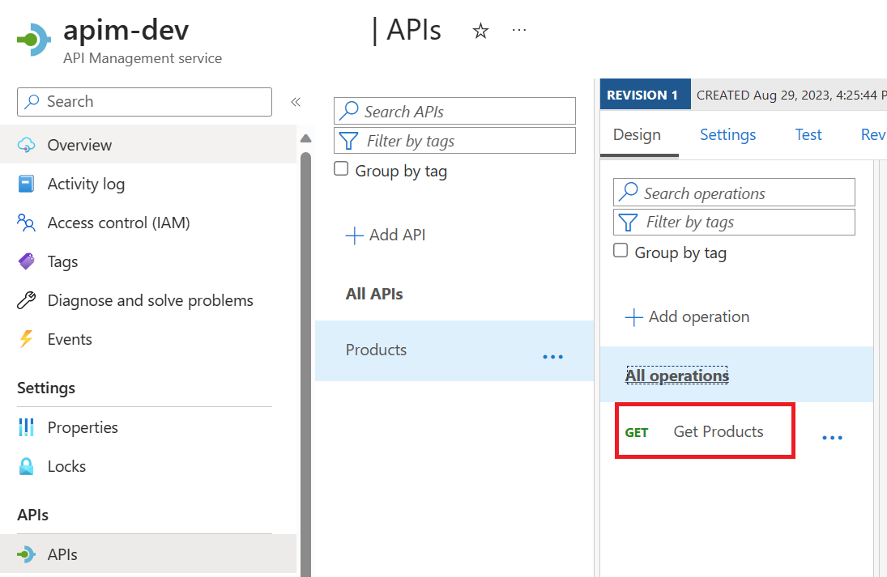

# Azure Cache for Redis Workshop

Welcome to this Azure Cache for Redis Workshop. You'll be experimenting with Azure Cache for Redis in multiple labs to discover how it's integrated to other Azure services by running a real world scenarios. Don't worry, even if the challenges will increase in difficulty, this is a step by step lab, you will be guided through the whole process.

During this workshop you will have the instructions to complete each steps. It is recommended to search for the answers in provided resources and links before looking at the solutions placed under the 'Toggle solution' panel.

## Prerequisites

Before starting this workshop, be sure you have:

- An Azure Subscription with the `Contributor` role to create and manage the labs' resources
- To run the different labs, you will have access to pre-configured GitHub Codespaces

If you want's to run the labs locally, make sure you have:
- [Visual Studio Code][vs-code] installed (you will use Dev Containers)
- Docker 
- The [Azure Function extension][azure-function-vs-code-extension]

Register the Azure providers on your Azure Subscription if not done yet: `Microsoft.Web`

<div class="task" data-title="Task">

> You will find the instructions and expected configurations for each Lab step in these yellow "Task" boxes.
> Inputs and parameters to select will be defined, all the rest can remain as default as it has no impact on the scenario.
>
> Log into your Azure subscription locally using Azure CLI and on the [Azure Portal][az-portal] using your own credentials.
> Instructions and solutions will be given for the Azure CLI, but you can also use the Azure Portal if you prefer.

</div>

<details>

<summary>Toggle solution</summary>

```bash
# Login to Azure
az login
# Display your account details
az account show
# Select your Azure subscription
az account set --subscription <subscription-id>

# Register the following Azure providers if they are not already
# Azure Functions
az provider register --namespace 'Microsoft.Web'
```

</details>


## Structure 


[az-cli-install]: https://learn.microsoft.com/en-us/cli/azure/install-azure-cli
[az-func-core-tools]: https://learn.microsoft.com/en-us/azure/azure-functions/functions-run-local?tabs=v4%2Clinux%2Ccsharp%2Cportal%2Cbash#install-the-azure-functions-core-tools
[vs-code]: https://code.visualstudio.com/
[azure-function-vs-code-extension]: https://marketplace.visualstudio.com/items?itemName=ms-azuretools.vscode-azurefunctions

---

# Lab 0 : Azure Cache for Redis

## Setting up the infrastructure in Azure

First thing you need to do is to download the [zip file][] that contains the infrastructure as code that needs to be deployed to do this Hands On Lab.

Once deploy open it and in a terminal run the following command to initialize terraform:

```bash
terraform init
```

Then to deploy the infrastructure:

```bash
terraform apply -auto-approve
```

The deployment take between 15 to 25 minutes depending on the Azure demands.

## Architecture overview

While you are deploying the infrastructure of the labs, let's discover it together:


## Redis basics 

[terraform-zip]: https://github.com/microsoft/hands-on-lab-redis/releases/download/latest/infrastructure-terraform.zip

---

# Lab 1 : Redis setup in Azure Infra Environment 

## From DB search to introducing caching 
### Postman testing

---

# Lab 2 : Add cache to your API with APIM

In the previous lab, you saw how to add code in your API to be able to use an Azure Cache for Redis. In this lab, you will see how to add a cache to your API without modifing its code.

## Architecture recap

If you look at the architecture you deployed for this workshop, you will see that you have an API Management (APIM) in front of the API that provide you the different products.


The APIM is used as a facade for all your APIs, in the next section you will discover how to add a cache on your APIs using the APIM and Azure Cache for Redis.

### Setup APIM External 

First things you need to do, is to connect your Azure Redis Cache to your APIM. To do this, you need to add it as an external cache in your APIM configuration.

So go to your resource group, search the API Management service (APIM), select it and in the left menu, click on **External cache**.


Then click on **Add** and fill the form with the following information:

- In the `Cache instance` field, select the Azure Cache for Redis you deployed in the previous lab.
- In the `Use from` field, set the region to `Default`, this will allow your Azure Cache for Redis to be used by all your APIM instances whatever their region.


Then, click the **Save** button.

You should now see your Azure Cache for Redis in the list of external cache:


### Setup APIM Cache Policy globally

Now that you have your Azure Cache for Redis connected to your APIM, you need to configure it to use it. To do this, you will use a policy.

Go to your resource group, search the API Management service (APIM), select it and in the left menu, click on **APIs**. You will see a **Product API** with a **Get Products** operation:



To be able to compare the performance of your API with and without the cache, you will first call it without the cache using [Postman][postman-link] or using the `products.http` inside the `Payloads` folder.

Go to the **Test** tab of the **Get Products** operation in your APIM and take the generated url inside the `Request URL` section.

If you use Postman and you should see the response of your API taking multiples seconds:


If you use the HTTP REST file you should see:


Now to reduce this time you can specify a policy to use the cache. Select `All operations` in the `Inbound processing` section and click on the **+ Add policy** button:


Select the cache-lookup/store policy and click on the **Add** button:


Set the duration to `30` seconds for the cache to be able to test it and click **Save**.


In real life scenario, this value will depend on your business needs.

That's it! You have now your cache policy setup globally to be used by your API. You can now test it again with Postman or HTTP REST you should see the response time of your API reduced to a few milliseconds!

### Caching a specific operation

In the previous section, you saw how to setup a cache policy globally for all your operations. But what if you want to cache only a specific operation?

Before you do this, you need to remove the global cache policy you just added. To do this, go to the **All operations** section of your API and click on the **...** button of the **cache-lookup** and the **cache-store** policies and select **Delete**:


Then click on the **Save** button.

Now, to cache only the **Get Products** operation you need to specify the redis cache key. To be able to do this you will use two policies: `cache-lookup-value` `cache-store-value`. They are a bit different from the previous policies as they allow you to specify the key to use in the cache.

This time, you will need to edit the policy manually. So go to the **Get Products** operation and click one of the **Policy code editor** button:


Then, inside the editor replace the inbound block of the policy with the following content:

```xml
<inbound>
    <base />
    <cache-lookup-value key="products:all" variable-name="allproducts" caching-type="external" />
    <choose>
        <when condition="@(context.Variables.ContainsKey("allproducts"))">
            <return-response>
                <set-status code="200" reason="OK" />
                <set-header name="Content-Type" exists-action="override">
                    <value>application/json</value>
                </set-header>
                <set-body>@((string)context.Variables["allproducts"])</set-body>
            </return-response>
        </when>
        <otherwise />
    </choose>
</inbound>
```

This policy will first try to get the value from the cache using the key `products:all` and if it exists, it will return it. If it exists it will return the result of the cache directly using the `return-response`. If it doesn't exist, it will continue the execution of the policy.

Then, add the following policy in the outbound block of the policy:

```xml
<outbound>
    <base />
    <cache-store-value key="products:all" value="@((string)context.Response.Body.As<string>(preserveContent: true))" duration="60" caching-type="external" />
</outbound>
```

This policy will store the result of the operation in the cache using the key `products:all` and the value of the response body. It will store it for 60 seconds. Of course, you can change the key and the duration to fit your needs.

Notice the `external` cache type is used in both policies. This is because you are using an external cache which is Azure Cache for Redis in your case. If you were using the internal cache of the APIM, you would have used the `internal` cache type.

Then, click on the **Save** button.

You can now test your API again with Postman or the HTTP REST file like previously and you should see the response time of this particular operation reduced to a few milliseconds, but this time only for the **Get Products** operation.

[postman-link]: https://www.postman.com/
---

# Lab 3 : Azure Cache for Redis Governance 

## Azure Monitor 

## Scaling 

## Security (RBAC + Private Endpoint ?)

---

# Lab 4 : Event-Driven Architecture 

## Redis Triggered Azure Function 

## Refresh caching on expired key 

--- 

# Lab 5 : Cloud-Native Architectures (AKS / ACA)

## TBD

---

# Lab 6 : AI infused Caching 

## TBD 