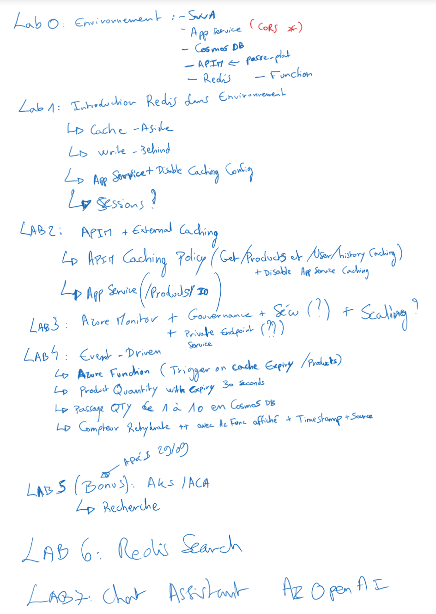

# Azure Cache for Redis Workshop

Welcome to this Azure Cache for Redis Workshop. You'll be experimenting with Azure Cache for Redis in multiple labs to discover how it's integrated to other Azure services by running a real world scenarios. Don't worry, even if the challenges will increase in difficulty, this is a step by step lab, you will be guided through the whole process.

During this workshop you will have the instructions to complete each steps. It is recommended to search for the answers in provided resources and links before looking at the solutions placed under the 'Toggle solution' panel.

## Prerequisites

Before starting this workshop, be sure you have:

- An Azure Subscription with the `Contributor` role to create and manage the labs' resources
- To run the different labs, you will have access to pre-configured GitHub Codespaces

If you want's to run the labs locally, make sure you have:
- [Visual Studio Code][vs-code] installed (you will use Dev Containers)
- Docker 
- The [Azure Function extension][azure-function-vs-code-extension]

Register the Azure providers on your Azure Subscription if not done yet: `Microsoft.Web`

<div class="task" data-title="Task">

> You will find the instructions and expected configurations for each Lab step in these yellow "Task" boxes.
> Inputs and parameters to select will be defined, all the rest can remain as default as it has no impact on the scenario.
>
> Log into your Azure subscription locally using Azure CLI and on the [Azure Portal][az-portal] using your own credentials.
> Instructions and solutions will be given for the Azure CLI, but you can also use the Azure Portal if you prefer.

</div>

<details>

<summary>Toggle solution</summary>

```bash
# Login to Azure
az login
# Display your account details
az account show
# Select your Azure subscription
az account set --subscription <subscription-id>

# Register the following Azure providers if they are not already
# Azure Functions
az provider register --namespace 'Microsoft.Web'
```

</details>


## Structure 


[az-cli-install]: https://learn.microsoft.com/en-us/cli/azure/install-azure-cli
[az-func-core-tools]: https://learn.microsoft.com/en-us/azure/azure-functions/functions-run-local?tabs=v4%2Clinux%2Ccsharp%2Cportal%2Cbash#install-the-azure-functions-core-tools
[vs-code]: https://code.visualstudio.com/
[azure-function-vs-code-extension]: https://marketplace.visualstudio.com/items?itemName=ms-azuretools.vscode-azurefunctions

---

# Lab 0 : Azure Cache for Redis

## Setting up the infrastructure in Azure

First thing you need to do is to download the [zip file][] that contains the infrastructure as code that needs to be deployed to do this Hands On Lab.

Once deploy open it and in a terminal run the following command to initialize terraform:

```bash
terraform init
```

Then to deploy the infrastructure:

```bash
terraform apply -auto-approve
```

The deployment take between 15 to 25 minutes depending on the Azure demands.

## Architecture overview

While you are deploying the infrastructure of the labs, let's discover it together:


## Redis basics 

---

# Lab 1 : Redis setup in Azure Infra Environment 

## From DB search to introducing caching 
### Postman testing

---

# Lab 2 : APIM External Caching Setup

## Setup APIM External 
## APIM Cache Policy delegation + API specific caching removal

---

# Lab 3 : Azure Cache for Redis Governance 

## Azure Monitor 

## Scaling 

## Security (RBAC + Private Endpoint ?)

---

# Lab 4 : Event-Driven Architecture 

## Redis Triggered Azure Function 

## Refresh caching on expired key 

--- 

# Lab 5 : Cloud-Native Architectures (AKS / ACA)

## TBD

---

# Lab 6 : AI infused Caching 

## TBD 