# Azure Cache for Redis Workshop

Welcome to this Azure Cache for Redis Workshop. You will be experimenting with Azure Cache for Redis in multiple labs to discover how it's integrated to other Azure services by running a real world scenarios. Don't worry, even if the challenges will increase in difficulty, this is a step by step lab, you will be guided through the whole process.

During this workshop you will have the instructions to complete each steps. It is recommended to search for the answers in the provided resources and links before looking at the solutions placed under the **Toggle solution** panel for a challenged based learning experience.

## Prerequisites

Before starting this workshop, be sure to have:

- An Azure Subscription with the **Contributor** role to create and manage the labs' resources and deploy the infrastructure as code
- Create a [fork][Repo-fork] of the repository from the **main** branch to help you keep track of your changes
- To run the different labs, you have 2 options: 
    - Use a devcontainer locally 
    - Use a Github Codespace
    
### Use your own local environment 

The following tools and access will be necessary to run the lab in good conditions on a local environment :  

- [Docker Desktop][Docker-desktop]
- [Visual Studio Code][vs-code] installed (you will use Dev Containers)
- [Git client][Git-client] 
- [A GitHub Account][Github-account] (Free or Enterprise)

Once you have cloned the repository locally, make sure Docker Desktop is up and running and open the cloned repository in Visual Studio Code. 
You will be prompted to open the project in a Dev Container. Click on `Reopen in Container`. 

If you are not prompted by Visual Studio Code, you can open the command palette (`Ctrl + Shift + P`) and search for `Reopen in Container` and select it: 


<div class="tip" data-title="Tips">

> To focus on the main purspose of the lab, we encourage the usage of devcontainers/codespace as they abstract the dev environment configuration, and avoid potential local dependencies conflict.
> You could decide to run everything without relying on a devcontainer : To do so, make sure you install all the prerequisites you could find in the `.devcontainer` folder.  
</div>

### Using a pre-configured GitHub Codespace 

Github Codespace offers the ability to run a complete dev environment (Visual Studio Code, Extensions, Tools, Secure port forwarding etc.) on a dedicated virtual machine. 
The configuration for the environment is defined in the `.devcontainer` folder, making sure everyone gets to develop and practice on identical environments : No more conflict on dependencies or missing tools ! 

Every Github account (even the free ones) grants access to 120 vcpu hours per month, _**for free**_. A 2 vcpu dedicated environment is enough for the purpose of the lab, meaning you could run such environment for 60 hours a month at no cost!

To get your codespace ready for the labs, here are a few steps to execute : 
- After you forked the repo, click on `<> Code`, `Codespaces` tab and then click on the `+` button:


- After a few minutes, the codespace opens and you will have to enter the Visual Studio Workspace to get all the tools ready. To do so, click the **burger menu** in the top left corner, **File** and then **Open Workspace from File...** 


- Select `.vscode/hands-on-lab-redis.code-workspace` : 


- You are now ready to go! For the rest of the lab, in case you lose the terminal, you can press `Ctrl + J` or open a new one here : 


Let's begin!

## Sign in to Azure

<div class="task" data-title="Task">

> - Log into your Azure subscription in your environment using Azure CLI and on the [Azure Portal][az-portal] using your credentials.
> - Instructions and solutions will be given for the Azure CLI, but you can also use the Azure Portal if you prefer.
> - Register the Azure providers on your Azure Subscription if not done yet: `Microsoft.Web`, `Microsoft.OperationalInsights`, `Microsoft.Cache`, `Microsoft.ApiManagement`, `Microsoft.DocumentDB`

</div>

<details>

<summary>Toggle solution</summary>

```bash
# Login to Azure : 
# --tenant : Optional | In case your Azure account has access to multiple tenants

# Option 1 : Local Environment 
az login --tenant <yourtenantid or domain.com>
# Option 2 : Github Codespace : you might need to specify --use-device-code parameter to ease the az cli authentication process
az login --use-device-code --tenant <yourtenantid or domain.com>

# Display your account details
az account show
# Select your Azure subscription Id 
az account set --subscription <subscription-id>

# Register the following Azure providers if they are not already
# App Service & Azure Functions
az provider register --namespace 'Microsoft.Web'
# Azure Monitor
az provider register --namespace 'Microsoft.OperationalInsights'
# Azure Cache for Redis
az provider register --namespace 'Microsoft.Cache'
# API Management
az provider register --namespace 'Microsoft.ApiManagement'
# Azure CosmosDb 
az provider register --namespace 'Microsoft.DocumentDB'
```

</details>

<div class="task" data-title="Task">

> You will find the instructions and expected configurations for each Lab step in these yellow "Task" boxes.
> Inputs and parameters to select will be defined, all the rest can remain as default as it has no impact on the scenario.

</div>

[az-cli-install]: https://learn.microsoft.com/en-us/cli/azure/install-azure-cli
[Docker-desktop]: https://www.docker.com/products/docker-desktop/
[vs-code]: https://code.visualstudio.com/
[Repo-fork]: https://github.com/microsoft/hands-on-lab-redis/fork
[Git-client]: https://git-scm.com/downloads
[Github-account]: https://github.com/join
[azure-vs-code-extension]: https://marketplace.visualstudio.com/items?itemName=ms-vscode.vscode-node-azure-pack
[az-portal]: https://portal.azure.com/signin/index/

---

# Lab 0 : Azure Cache for Redis

## Setting up the infrastructure in Azure

If you look at the project, you will see a `terraform` folder. It contains the infrastructure as code that you will use to deploy the infrastructure for this Hands On Lab. This will deploy a series of Azure services that you will use in combination with Azure Cache for Redis.

In a terminal run the following command to initialize terraform:

```bash
cd terraform && terraform init
```

Then deploy the infrastructure:

```bash
terraform apply -auto-approve
```

<div class="warning" data-title="Warning">

> The deployment can take up to 25 minutes : Make sure to keep your codespace or local environment running during the infrastructure creation. 
</div>

## Architecture overview

While you are deploying the infrastructure of the labs, let's discover it together:


The architecture is composed of the following elements:
- An Azure Static Web App that will be used to display the data from the API
- An App Service that will host an API and store the data in a Cosmos DB database
- An APIM which will be used as a facade for the APIs
- An Azure Cache for Redis that will be used to cache the data of the API
- A first Azure Function that will be triggered by an event of the Azure Cache for Redis to refresh the cache when the data expires
- A second Azure Function that will be used to retrieve and store the navigation history of a specific user in Azure Cache for Redis
- Azure Monitor that will be used to monitor the Azure Cache for Redis

You will discover all these elements during this Hands On Lab.

## Seed the database

In this Hands On Lab, you will use a Cosmos DB database to store and retrieve your data. To save time, you will seed it with some data.

To do this, download the [zip file][database-seed-zip] that contains the data to seed your database, then unzip it and you will find a `products.json` file.

Go to your resource group, search the Cosmos DB account, select it and in the left menu, click on **Data Explorer**. Then on the database called `catalogdb` and click on the `products` container and select `Items` like below:


Then, click on the **Upload Item** button and select the `products.json` file you just downloaded and click **Upload**. This will upload the data in your database:


*The number of products in the screenshot can differ from the number of products you have in your file.*

Now, if you close the **Upload Item** window and click on the **Refresh** button, you should see the data in your database:


You have now seeded your database with the data for this Hands On Lab.

## Redis basics 

To be able to use Azure Cache for Redis, you need to understand the basics of Redis. Redis is an open source, in-memory data structure store, used as a database, cache, and message broker. It supports data structures such as strings, hashes, lists, sets, sorted sets with range queries, bitmaps, hyperloglogs, geospatial indexes with radius queries and streams.
<!-- TODO: Add context on Redis OSS, Azure Cache for Redis, Azure Cache for Redis Enterprise -->

<div class="tip" data-title="Tips">

> While you are going to use some of these data structures through the course of this lab, it will mainly focus on scenarios and connecting Azure Services with Azure Cache for Redis. 
>
> You might want to practice with another lab focused on [interacting with Azure Cache for Redis Data Structures][redis-practice-lab]. 

</div>

<!-- TODO : Explain how to interact with Redis and how it works concretely -->

Let's see quickly how to interact with Azure Cache for Redis. Go to your resource group, search the Azure Cache for Redis resource, select it and in the left menu, click on **Overview** and click on the **Console** button:


Now inside the console, let's play with basic Redis commands.

Run the following command to set a key/value pair in Redis:

```bash
set key1 myvalue1
```

To retrieve the value of the key, run the command:

```bash
get key1
```

To check if a key exists in Redis, just run:

```bash
exists key1
```

To delete a specific key in Redis, run the command:

```bash
del key1
```

Run the following commands to set a key with an expiration of 10 seconds in Redis:

```bash
set key1 myvalue1
expire key1 10
```

After 10 seconds, if you run the `get` command on `key1`, you will see that the key will return `nil` which means that the key doesn't exist anymore.

To test if Redis is working, you can run the `ping` command:

```bash
ping
```

It should return `PONG` which means that Redis is working.


To summarize, you can use the following basic commands to interact with Redis:

- `set` [key] [value]: Sets a key/value in the cache. Returns `OK` on success.
- `get` [key]: Gets a value from the cache.
- `exists` [key]: Returns `1` if the key exists in the cache, otherwise `0` if it doesn’t.
- `del` [key]: Deletes the value associated with the key.
- `expire` [key] [value in seconds]: Expires the key after the specified number of seconds.
- `ping`: Ping the server. Returns `PONG`.

[database-seed-zip]: https://github.com/microsoft/hands-on-lab-redis/releases/download/latest/database-sample-data.zip
[redis-practice-lab]: https://azure.github.io/redis-on-azure-workshop/

---

# Lab 1 : Use Azure Redis Cache in your API

In this lab, you will see how to use Azure Cache for Redis in your API to improve its performance. This API is an ASP.NET Web API written in .NET 7 and you will use the [StackExchange.Redis][stackexchange-redis] NuGet package to interact with Redis. One of the goal of this API is to provide a list of products that you will display in a web application.

<!-- TODO: Check if more context is required -->

<div class="tip" data-title="Tips">

> Redis Cache has a set of different clients to connect to it. For your real world scenario, pick the client that fits your preferred development language as detailed [here][redis-dev-clients] : All of these are compatible with Azure Cache for Redis instances.

</div>

## Run the API

Open the `src/catalog-api` folder in Visual Studio Code in your active devcontainer or GitHub Codespace.

<!-- TODO : Check formulation ! -->

For the purpose of this lab you will have to add a delay for the response of the API to be able to see the difference between the response time with and without the cache. This is because a database like Cosmos Db is able to return the data in a few milliseconds after a few calls so you won't be able to see the difference between the response time with and without the cache after a few retry.

To do this, copy the entire content of the `appsettings.json.template` into a new file called `appsettings.Development.json` in `src/catalog-api` and set the `SIMULATED_DB_LATENCY_IN_SECONDS` value to `2`.

<div class="task" data-title="Task">

> - Set the Cosmos Db connection string in the `appsettings.Development.json` file
> - Set the Redis connection string in the `appsettings.Development.json` file
> - Run the API in your devcontainer or using the provided GitHub Codespace.
> - Call the GET `/products` endpoint to confirm that the API is working

</div>

<details>

<summary>Toggle solution</summary>

Start by duplicating the `appsettings.json.template` from Visual Studio Code file explorer to `appsettings.Development.json` OR by running the following command : 

```bash 
cd src/catalog-api
cp appsettings.json.template appsettings.Development.json
``` 

Inside the Azure Portal, go to your resource group, search for the Cosmos DB account, select it and in the left menu, click on **Keys**. Then copy the **Primary Connection String** and replace `"AZURE_COSMOSDB_CONNECTION_STRING"` value in `appsettings.Development.json` :


Then inside the Azure Portal, go to your resource group, search the Azure Cache for Redis, select it and in the left menu, click on **Access keys**. Then copy the **Primary Connection String** and replace `"AZURE_REDIS_CONNECTION_STRING"` value in the `appsettings.Development.json` file :


You can now run debug for the catalog-api by selecting **Run and Debug** in the left menu, select `.Net Core Launch (web)` and click the green arrow : 

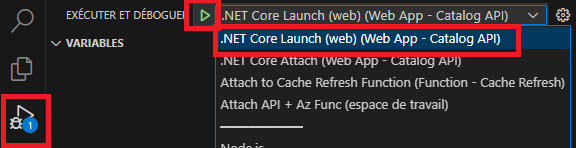

Depending on the environment you are using : 
- Devcontainer : 
    - Once the api is running, browse for the url: http://localhost:5076/products and you should see the list of products.
- Github Codespace : 
    - Once the api is running, click on the **ports** tab in the bottom part of Visual Studio Code window. You should retrieve the unique domain name generated for the combination of your codespace and the port being forwarded.
    - Right click on port `5076` and click **Open in Browser**. <!-- TODO: Fix Codespace access issues -->
    - You can now browse for http://<your-unique-domain-&-port>/products and you should see the list of products.

</details>

## Add Azure Cache for Redis to your API

If you look at the `Catalog.Api.csproj` you will see that the `StackExchange.Redis` NuGet package is already referenced in the project. This is the package that will allow you to use Azure Cache for Redis in your .NET API.

The goal of this part is to set up the interactions with Azure Cache for Redis in your API and to use it to improve the performance of the `/products` endpoint. To do this, you will use the `ProductCacheService.cs` class which is pre-configured for you.

If you open it you will see two methods:
- `GetProductsAsync`: This method is used to get the products from the cache
- `SetProductsAsync`: This method is used to set the products in the cache

They both use the `IRedisService` interface to interact with the cache and use the mechanism of serialization/deserialization to store and retrieve data.

<div class="tip" data-title="Tips">

> These Get & Set Async methods have been built specifically for this lab to simplify exception handling and serialization as much as possible in your interaction with Azure Cache for Redis.
> However, the actual Get and Set queries sent to the Redis Cache reside in the simple methods provided by the StackExchange.Redis package, and that you can see in the `RedisService.cs` class as the extract below : 

> ```csharp
> await _database.StringGetAsync(key);
> ...
> await _database.StringSetAsync(key, value);  
> ```    

</div>

Now it is time to work with Azure Cache for Redis to retrieve and return the list of products provided by the persistence tier played by CosmosDb in this lab's scenario. 
If no product exists in your Azure Cache for Redis Instance, then you will need to retrieve a fresh list of products from your persisting database (CosmosDb) and rehydrate the cache with this fresh data. 
This way, the next call will extract the list of products directly from the cache, improving the overall request performance, as well as freeing up resources for the database to focus on actual data persistence activities.

<div class="task" data-title="Tasks">

> - Open the `ProductEndpoints.cs` file
> - Use the `IProductCacheService` to setup the caching system in the `/products` endpoint 

</div>

<details>
<summary>Toggle solution</summary>

Inside the `ProductEndpoints.cs` file and in the  `/products` endpoint use the `IProductCacheService` to retrieve the products from the cache. If some products are found in the cache, return them directly: 

```csharp
IEnumerable<Product>? cachedProducts = await productCacheService.GetProductsAsync();

if (cachedProducts != null) {
    Console.WriteLine("Returning product list from the cache");
    return Results.Ok(cachedProducts);
}
```

If no product is found in the cache, fetch the data from Cosmos DB and store them in the cache before returning them:

```csharp
// Fetch data from Cosmos DB
var products = await cosmosService.RetrieveAllProductsAsync();

if (products.Any()) {
    await productCacheService.SetProductsAsync(products);
}

return Results.Ok(products);
```

So the final code of the endpoint should look like this:

```csharp
app.MapGet("/products", async (ICosmosService cosmosService, IProductCacheService productCacheService) => {
    IEnumerable<Product>? cachedProducts = await productCacheService.GetProductsAsync();

    if (cachedProducts != null) {
        Console.WriteLine("Returning product list from the cache");
        return Results.Ok(cachedProducts);
    }

    // Fetch data from Cosmos DB
    var products = await cosmosService.RetrieveAllProductsAsync();

    if (products.Any()) {
        await productCacheService.SetProductsAsync(products);
    }

    return Results.Ok(products);
});
```

Now, if you run your API again and call the `/products` endpoint, you should see the response time of your API reduced to a few milliseconds!
</details>

## Deploy the API to Azure

Now that you have your API working locally, you will deploy it to Azure. To do this, you will use the Azure App Service. This service allows you to host your API in the cloud.

To deploy your API directly from Visual Studio Code, you will use the Azure extension.

Search your App Service in the Visual Studio Code Azure extension and click on the **Deploy to Web App...** button:


Then, select the `catalog-api` folder and click on the **Deploy** button. Wait a few minutes for the deployment to finish. All the environment variables such as the connection string to Azure Cache for Redis and Cosmos Db was already configured in the Azure App Service for you by the infrastructure as code.

When it's done go to your App Service resource on Azure and click on the **Browse** button. Navigate to the `/products` endpoint and you should see the list of products:


[redis-dev-clients]: https://redis.io/docs/clients/
[api-zip]: https://github.com/microsoft/hands-on-lab-redis/releases/download/latest/catalog-api.zip
[stackexchange-redis]: https://www.nuget.org/packages/StackExchange.Redis

---

# Lab 2 : Add cache to your API with APIM

In the previous lab, you saw how to add code in your API to be able to use an Azure Cache for Redis. In this lab, you will see how to add a cache to your API without modifing its code.

## Architecture reminder

If you look at the architecture that you deployed for this workshop, remember that you have an API Management (APIM) in front of the API that provide you the different products.


The APIM is used as a facade for all your APIs (in this case you only have one), in the next section you will discover how to add a cache on your APIs using the APIM and Azure Cache for Redis.

## Disabling cache in your API

In the previous lab, you added code in your API to use an Azure Cache for Redis directly on the `/products` endpoint. To avoid modifying the code of your API, we have added an environment variable called `PRODUCT_LIST_CACHE_DISABLE` that you can use to enable or disable the cache on this endpoint.

To disable the cache, you need to set the value of this environment variable to `1`. To do this, go to your resource group, search the App service, select it and in the left menu, click on **Configuration**. 
You will see the `PRODUCT_LIST_CACHE_DISABLE` environment variable, select the edit button:

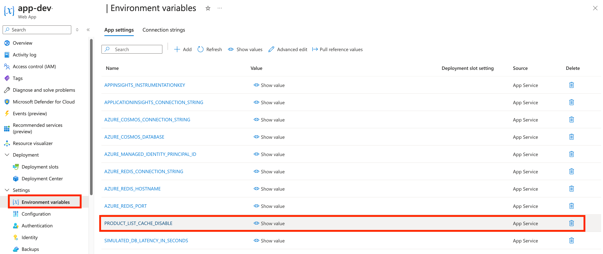

and set the value to `1` and click on the **OK** button.

Now if you try to call your API on the `/products` endpoints you should see the response time of your API taking multiples seconds again.

## Setup APIM External 

First things you need to do, is to connect your Azure Cache for Redis to your APIM. To do this, you need to add it as an external cache in your APIM configuration.

<div class="task" data-title="Tasks">

> - Inside your APIM link your Azure Cache for Redis as an external cache
> - Make sure to choose the `Default` region to be able to use it from all your APIM instances

</div>

<details>
<summary>Toggle solution</summary>

Go to your resource group, search the API Management service (APIM), select it and in the left menu, click on **External cache**.


Then click on **Add** and fill the form with the following information:

- In the `Cache instance` field, select the Azure Cache for Redis you deployed using the infrastructure as code
- In the `Use from` field, set the region to `Default`, this will allow your Azure Cache for Redis to be used by all your APIM instances whatever their region.


Then, click the **Save** button.

You should now see your Azure Cache for Redis in the list of external cache:


</details>

### Setup APIM Cache Policy globally

Now that you have your Azure Cache for Redis connected to your APIM, you need to configure it to use it. To do this, you will use policy.

<div class="task" data-title="Tasks">

> - Using the interface add the policies `cache-lookup` and `cache-store` to cache all the operations of your API
> - Set the duration to `30` seconds for the cache to be able to test it

</div>

<div class="tip" data-title="Tips">

> You can find more information about the cache policies here:<br>
> [Cache Lookup Policy][cache-lookup-policy]<br>
> [Cache Store Policy][cache-store-policy]

</div>

<details>
<summary>Toggle solution</summary>

To be able to compare the performance of your API with and without the cache, you will first call it without the cache using [Postman][postman-link] or using the `products.http` inside the `Payloads` folder.

To do so, go to your resource group, search the API Management service (APIM) and copy the name of the resource into the `products.http`.

Now using HTTP REST file for instance you should see the response time of your API taking multiples seconds:


Now to reduce this time you can specify a policy to use the cache. Select **All operations** in the **Inbound processing** section and click on the **+ Add policy** button:


Select the cache-lookup/store policy and click on the **Add** button:


Set the duration to `30` seconds for the cache to be able to test it and click **Save**:


In real life scenario, this value will depend on your business needs.

That's it! You have now your cache policy setup **globally** on your API. You can now test it again with Postman or HTTP REST you should see the response time of your API reduced to a few milliseconds!
</details>

### Caching a specific operation

In the previous section, you saw how to setup a cache policy globally for all your operations. But what if you want to cache only a specific operation?

Before testing this scenario, you need to remove the global cache policy you just added. To do this, go to the **All operations** section of your API and click on the **...** button of the **cache-lookup** and the **cache-store** policies and select **Delete**:


Then click on the **Save** button.

<div class="task" data-title="Tasks">

> - This task is a more advanced one, you will need to edit the policy manually
> - Use the policies `cache-lookup-value` and `cache-store-value` to cache only the **Get Products** operation
> - Set the duration to `60` seconds for the cache to be able to test it
> - You will need to use the `return-response` in the `inbound` block of the policy to return the result of the cache directly if it exists

</div>

<div class="tip" data-title="Tips">

> You can find more information about the cache policies here:<br>
> [Cache Lookup Value Policy][cache-lookup-value-policy]<br>
> [Cache Store Value Policy][cache-store-value-policy]

</div>

<details>
<summary>Toggle solution</summary>

To cache only the **Get Products** operation you need to specify the redis cache key. To be able to do this you will use two policies: `cache-lookup-value` and `cache-store-value`. They are a bit different from the previous policies as they allow you to specify the key to use in the cache.

This time, you will need to edit the policy manually. So go to the **Get Products** operation and click one of the **Policy code editor** button:


Then, inside the editor replace the `inbound` block of the policy with the following content:

```xml
<inbound>
    <base />
    <cache-lookup-value key="products:all" variable-name="allproducts" caching-type="external" />
    <choose>
        <when condition="@(context.Variables.ContainsKey("allproducts"))">
            <return-response>
                <set-status code="200" reason="OK" />
                <set-header name="Content-Type" exists-action="override">
                    <value>application/json</value>
                </set-header>
                <set-body>@((string)context.Variables["allproducts"])</set-body>
            </return-response>
        </when>
        <otherwise />
    </choose>
</inbound>
```

This policy will first try to get the value from the cache using the key `products:all` and if it exists, it will return it. If it exists it will return the result of the cache directly using the `return-response`. If it doesn't exist, it will continue the execution of the policy.

Then, add the following policy in the outbound block of the policy:

```xml
<outbound>
    <base />
    <cache-store-value key="products:all" value="@((string)context.Response.Body.As<string>(preserveContent: true))" duration="60" caching-type="external" />
</outbound>
```

This policy will store the result of the operation in the cache using the key `products:all` and the value of the response body. It will store it for 60 seconds. Of course, you can change the key and the duration to fit your needs.

Notice the `external` cache type is used in both policies. This is because you are using an external cache which is Azure Cache for Redis in your case. If you were using the internal cache of the APIM, you would have used the `internal` cache type.

Then, click on the **Save** button.

You can now test your API again with Postman or the HTTP REST file like previously and you should see the response time of this particular operation reduced to a few milliseconds, but this time only for the **Get Products** operation.

</details>

[postman-link]: https://www.postman.com/
[cache-lookup-policy]: https://learn.microsoft.com/en-us/azure/api-management/cache-lookup-policy
[cache-store-policy]: https://learn.microsoft.com/en-us/azure/api-management/cache-store-policy
[cache-lookup-value-policy]: https://learn.microsoft.com/en-us/azure/api-management/cache-lookup-value-policy
[cache-store-value-policy]: https://learn.microsoft.com/en-us/azure/api-management/cache-store-value-policy

---

# Lab 3 : Event-Driven Architecture 

In this lab you will see how to create cloud-native applications which can integrate with Azure Cache for Redis.

You will have to create 2 Function Apps which react to changes in Redis to perform an action:
- `cache-refresh-func`: detect expired cache keys and trigger a cache warm up to re-populate them
- `history-func`: process browsing history events from a Redis Stream and expose them via an HTTP API

## Lab 3.1: Refresh the cache

In the previous lab about APIM you saw how to add a cache to your API without modifying its code. In this lab you will see how to refresh the cache when the data expired before the data is requested by the user.

The idea is to use an [Azure Function][azure-function-overview] triggered by an Azure Cache for Redis event to refresh the cache when the data expired.

Azure Functions is a serverless solution that provides up-to-date compute resources, so you don't need to worry about deploying and maintaining infrastructure. It offers a common function programming model for various languages, allowing you to focus on your code while Azure Functions handles the rest.

Azure Functions are event-driven and triggered by events from various sources. The model uses `triggers` and `bindings` to avoid hardcoding access to other services:

- Bindings connect other resources to the function declaratively
- Triggers define how a function is invoked and provide associated data as a parameter payload.

Azure Functions run on the App Service platform, which provides features such as deployment slots, continuous deployment, HTTPS support, and hybrid connections. They can be deployed in the Consumption (Serverless), dedicated App Service Plan, or Premium Plan models.

### Keyspace Notifications

While Azure Cache for Redis manages the wraping of Keyspace events, it's mandatory to detail the event types you're interested in.

To do so, you'll set the maximum level of notification possible to notify all the existing events in the Azure Cache for Redis **Advanced Settings** and **notify-keyspace-events**:


<div class="tip" data-title="Tips">

> Resources : You'll find more insights [here][key-notifications-setup] on the events type that can be notified to fine-tune the notifications' scope

</div>

### Redis Triggered Azure Function

Open the Azure Function project in Visual Studio Code which is under `src/cache-refresh-func` and go to the `RefreshProductsCache.cs`. You will discover a method called `ProductsEventsTrigger` which is empty.

This method has an attribute called `RedisPubSubTrigger` which is used to trigger the function when an event is raised by the Azure Cache for Redis.

<div class="task" data-title="Tasks">

> - Define the conditions to trigger the function based on the expiration of a key in the Azure Cache for Redis
> - The connection string of the Azure Cache for Redis is defined by the environment variable `AZURE_REDIS_CONNECTION_STRING`

</div>

<div class="tip" data-title="Tips">

> You can find more information about the keys here:<br>
> - The Azure Function here use the isolated process mode but at this time the documentation is not updated so use the in-process tab to see examples: [Key Binding][key-bindings]<br>
> - [Redis key notification][key-notifications]<br>
</div>

<details>
<summary>Toggle solution</summary>

The `RedisPubSubTrigger` attribute is used to trigger the function when an event is raised by the Azure Cache for Redis, so the first parameter is the connection string and the second one is the pattern to listen to.

The connection string environment key `AZURE_REDIS_CONNECTION_STRING` can be specified directly because Azure Functions automatically understands that it is a connection string. Then based on the [Redis key notification documentation][key-notifications] you can use the `expired` event so the pattern to listen to the expiration event of a key will be `__keyevent@0__:expired`.

So the definition of the function should look like this:

```csharp
public async Task ProductsEventsTrigger(
    [RedisPubSubTrigger("AZURE_REDIS_CONNECTION_STRING", "__keyevent@0__:expired")] string key)
```

</details>

### Refresh the Redis Cache

Now that we have defined the conditions to trigger the function, we need to implement the logic to refresh the cache.

The key to listen to is defined in the `local.settings.json.template` file in the `REDIS_KEY_PRODUCTS_ALL` environment variable. This environment variable is set to `products:all` which is the key that you used in the previous lab to store the products in the cache.

All environment variables are defined in the `local.settings.json` that you must create if you want to run this Azure Function locally (you just have to copy paste the template from the `local.settings.json.template` file).

If you run this Azure Function and listen to the expired keys in the Azure Cache for Redis, you will see that the function is triggered when a key with a suffix of `products:all` is expired. In fact this is because APIM add a prefix to it to avoid conflicts with other keys so you can see a key like `1_products:all` for instance.

<div class="task" data-title="Tasks">

> The goal is to detect when the cache is expired and to refresh it for the `products:all` key.
> - Only refresh the cache if the key contains `products:all`
> - Use the `Const.cs` file to point to the `REDIS_KEY_PRODUCTS_ALL` environment variable
> - Call the Catalog Api endpoint in APIM using the `IHttpClientFactory` object provided to retrieve the `products`
> - Only this method should be modified

</div>

<details>
<summary>Toggle solution</summary>

First you need to check if the key contains `products:all` and if it does, you need to refresh the cache. 

Then call the Catalog API `/products` endpoint in APIM using the `IHttpClientFactory` object provided to retrieve the `products` using the `GetStringAsync()`. For the purpose of the lab, no need to manage the HTTP Response from APIM as the sole objective is to request a refresh of the cache, using the `Cache policy` defined in the previous lab.

```csharp
public async Task ProductsEventsTrigger(
    [RedisPubSubTrigger("AZURE_REDIS_CONNECTION_STRING", "__keyevent@0__:expired")] string key)
{
    if (key.Contains(Const.REDIS_KEY_PRODUCTS_ALL))
    {
        _logger.LogInformation($"{key} just EXPIRED");

        //Calling APIM to request fresh product catalog from data source after cache expired
        await _httpCatalogApiClient.GetStringAsync("products");
        
        _logger.LogInformation($"called APIM to force Redis refresh key '{key}' with fresh product catalog from data source.");
    }
}
```

Now, to test and run it locally you need to create the `local.settings.json` file and copy the content of the `local.settings.json.template` file into it. 

Then you need to set the `AZURE_REDIS_CONNECTION_STRING` environment variable to the connection string of your Azure Cache for Redis and update the `CATALOG_API_URL` with the url of APIM endpoint for the Catalog API.

The connection string for your Azure Cache for Redis can be found in the Azure Portal. Select your Azure Cache for Redis resource and in the left menu, click on **Access keys**. Then copy the value of the `Primary connection string` into your `local.settings.json` file.

![Azure Cache for Redis connection string][azure-cache-for-redis-connection-string]

To set the `CATALOG_API_URL` environment variable, go to your resource group, search the API Management resource and select it. Then copy the `Gateway URL` found in the **Overview** panel of your API Management.


To debug the Cache Refresh Azure Function in VS Code, you will need to start Azurite (an Azure Storage Account emulator required to debug Azure Functions locally) :  
1. In VS Code, Press `Ctrl + Shift + P`, then search `Azurite: Start` and select this option : 


1. Then run the Azure Function by clicking on the **Run and Debug** panel and select `Attach to Cache Refresh Function`:


</details>

### Deploy the Azure Function

#### Option 1 : Deploy with VS Code

- Open the Azure extension in VS Code left panel
- Make sure you're signed in to your Azure account
- Open the Function App panel
- Right click on your function app that start with `func-cache` and select `Deploy to Function App...`


#### Option 2 : Deploy with Azure Function Core Tools

Deploy your function using the VS Code extension or by command line:

```bash
func azure functionapp publish <NAME_OF_YOUR_FUNCTION_APP>
```

#### Test the Azure Function

Now if you go to your Azure Function resource, in the **Overview** tab select your function:


Do a few call to set a value in the cache with your `products.http` file and then inside the **Monitor** tab you should see that the function was triggered when the key `products:all` is expired:


You now have an Azure Function that is triggered every time the key `products:all` is expired and refresh the cache.

## Lab 3.2: Browse history

You have previously created an Azure Function which reacts to cache expiry by listening to keyspace events. In this second part of this lab you will create a second Azure Function called `history-func` which will consume Redis Streams and process incoming Stream entries.

This new Azure Function will power an API for retrieving a user's browsing history (which products the user viewed recently).

The following sequence diagram illustrates how `history-func` gets data updates from `catalog-api` via the Redis Stream and how it serves the browsing history via the HTTP endpoint `/api/history` to the Web App:

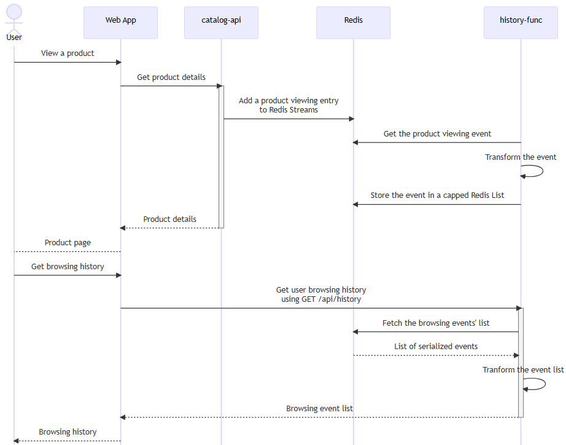

### Inspecting product views' stream

First thing first, let's take a look at the Streams currently available on your Azure Cache for Redis instance.

The goal is to locate the [Redis Stream][redis-streams] in which the `catalog-api` is adding new items whenever a user views a product. Afterwards you need to inspect that stream and take a look at the events/items added to it.

To do this, there is a variety of tools that you can use to inspect Redis data like the integrated [Redis Console][redis-console] and also the fully-featured GUI [RedisInsight][redis-insight].


<div class="task" data-title="Task">

>  - View some products in the Web App to generate items in the stream. You can alternatively call the `/products/:id` endpoint from `catalog-api` like you did in Lab1.
>  - Locate the stream where `catalog-api` publishes product viewing events. Your hint is the name of the stream.
>  - Inspect the items in the Stream using `Redis Console` from the Azure portal.
>  - View more products in the Web App and make sure new items get added in the stream.

</div>

<div class="tip" data-title="Tips">

> - [Redis Console][redis-console]
> - [SCAN command][redis-scan-command]
> - [XRANGE command][redis-xrange-command]

</div>

<details>
<summary>Toggle solution</summary>

Open the [Redis Console][redis-console] of your Azure Cache for Redis instance.


Then use the [SCAN command][redis-scan-command] to list all keys having a type `stream`:

```sh
SCAN 0 TYPE stream
```

You should see a stream called `productViews`. That is the one we are interested in.


Next, view the list of items in the stream using the [XRANGE command][redis-xrange-command] and the special -/+ special IDs which allow us to get all items within a stream:

```sh
XRANGE productViews - +
```

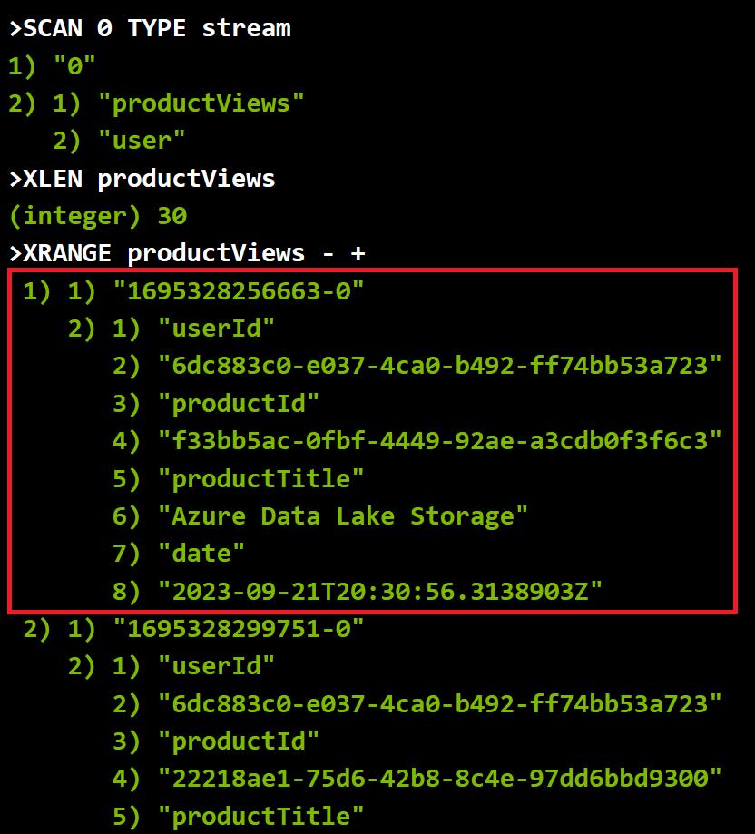

You should be able to see the following item fields:
- `userId`: The ID of the user who performed the action
- `productId`: The ID of the product which was viewed
- `productTitle`: The title of the product which was viewed
- `date`: The time (in ISO 8601) at which the product was viewed
</details>

[redis-streams]: https://redis.io/docs/data-types/streams/
[redis-console]: https://learn.microsoft.com/en-us/azure/azure-cache-for-redis/cache-configure#redis-console
[redis-scan-command]: https://redis.io/commands/scan/
[redis-xrange-command]: https://redis.io/commands/xrange/#--and--special-ids
[redis-insight]: https://redis.com/redis-enterprise/redis-insight/


### Consuming product views' stream using Azure Functions

Now that you have identified the product views' stream, you will need to update the `history-func` Function App to get triggered whenever a new event gets published to the stream.

<div class="task" data-title="Task">

> - Update the trigger of the function `StreamTrigger` defined in `src/history-func/ProcessProductViews.cs` so that it listens to new items in the product views' stream

</div>

<div class="tip" data-title="Tips">

> - [Sample of Azure Functions' triggers for Redis][redis-triggers-sample]
> - [RedisStreamTrigger][redis-stream-trigger]

</div>

<details>
<summary>Toggle solution</summary>

Update the method `StreamTrigger` and replace the trigger placeholder (the `TODO` comment) with the following code: 

```csharp
[RedisStreamTrigger("AZURE_REDIS_CONNECTION_STRING", "%PRODUCT_VIEWS_STREAM_NAME%")] string entry
```

This will make the function trigger whenever there is a new item on the stream identified by the environment variable `PRODUCT_VIEWS_STREAM_NAME`. Notice the `%` before and after the environment variable name, this is used to indicate that the value of the environment variable should be used instead of the name of the environment variable.
Azure Function can automatically resolve the value of the environment variable `AZURE_REDIS_CONNECTION_STRING` because it's a connection string, so no need to add `%` before and after.

</details>

### Testing the function locally

Next, you need to ensure that your Azure Function works as expected and manages to process new events.

To do this, make sure that you have a `local.settings.json` file (a template is available in `src/history-func/local.settings.json.template`), run the function locally, then view a new product in the web app and make sure that you see a new event being processed in the Azure Function.

<div class="task" data-title="Task">

> Run the `src/history-func` Azure Function locally and ensure it gets triggered whenever you view new products in the Web App

</div>

<div class="tip" data-title="Tips">

> - Use a different port for this Azure Function (e.g. 7072) as the default port may already be used by the `catalog-api` or another Azure Function.
> - You can use [func start -p 7072][func-start] to listen on port 7072

</div>

<details>
<summary>Toggle solution</summary>

First, you will start by creating a new `local.settings.json` file.

```sh
# Go to the root of the history-func Function App
cd src/history-func

# Create a local.settings.json file from the template
cp local.settings.json.template local.settings.json
```

Then you need to update the value of `AZURE_REDIS_CONNECTION_STRING` that you can retreive in your redis instance:

![Azure Cache for Redis connection string][azure-cache-for-redis-connection-string]

Now that you have the required config, you can run the function:

```sh
# Load all dependencies
dotnet restore

# Start the Function App
func start -p 7072
```

Once it starts, you can browse the Web App and ensure new product views' event processing logs appear on your terminal:


</details>

### Retrieving user browsing history using an HTTP endpoint

Lastly, let's check the HTTP endpoint of `history-func` and ensure that it returns all browsing history for a given user.

<div class="task" data-title="Task">

> Call the `/api/history` endpoint and ensure it returns the latest products that you have viewed on the Web App

</div>

<div class="tip" data-title="Tips">

> The `/api/history` is expecting the user ID to be passed in the `X-USER-ID` header, you can get the user ID from the Web App in the top right corner.

</div>

<details>
<summary>Toggle solution</summary>

As the Azure Function is already up and running, you can directly call the `/api/history` endpoint with a GET request and ensure the ID of the user for whom you want to get the history is defined in the `X-USER-ID` header.


Before calling the endpoint, make sure to get a User ID by copying the UUID that you see on the top right of the Web App. You can also get it from the field `userId` in the stream data items.

So the final request should look like this:

```sh
curl \
    --location 'http://localhost:7072/api/history' \
    --header 'X-USER-ID: <Set the User ID here>'
```

Of course you can test it with an other tool like [Postman][postman-link] for instance.

</details>

### Deploying history-func to Azure

You have confirmed that your code is working fine locally, so now you can proceed to the next step: deploying it to Azure.

<div class="task" data-title="Task">

> Deploy the `history-func` app to Azure on the Azure Function that start with `func-hist`

</div>

<details>
<summary>Toggle solution</summary>

You can do this using the Visual Studio Code extension like you saw in the previous section of this lab or by command line using the Azure Function Core Tools:

```sh
func azure functionapp publish <NAME_OF_YOUR_HISTORY_FUNCTION_APP>
```

</details>

### Viewing browsing history in the Web App

In this last part, you will wire the newly deployed `history-func` app to the Web App using the app setting `HISTORY_API`.

This will allow the Web App to communicate with your new History API (`/api/history`) to retrieve and display the current user's browsing history.


<div class="task" data-title="Task">

> - Update the Web App's app setting `HISTORY_API` to point to the `/api/history` API endpoint of `history-func`.
> - Click on the UUID of the user on the top right of the Web App and make sure you can see your browsing history.

</div>

<details>
<summary>Toggle solution</summary>

To configure the Static Web App to use the new `/api/history` endpoint you will first need to get its full url.

To do that, first head to the `history-func` Function App in the Azure Portal, then select the function `GetBrowsingHistory`.

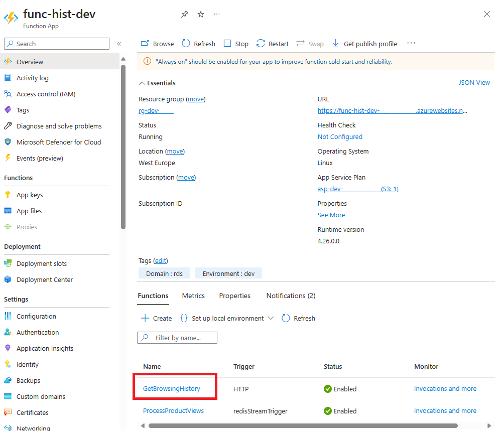

Then select the `Get Function Url` button and copy the function url:

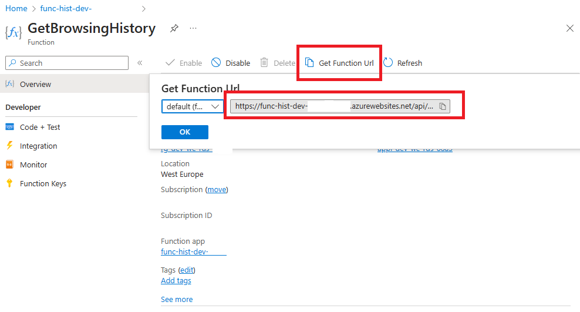

Next, you need to add that url in the `HISTORY_API` app setting of the static web app:

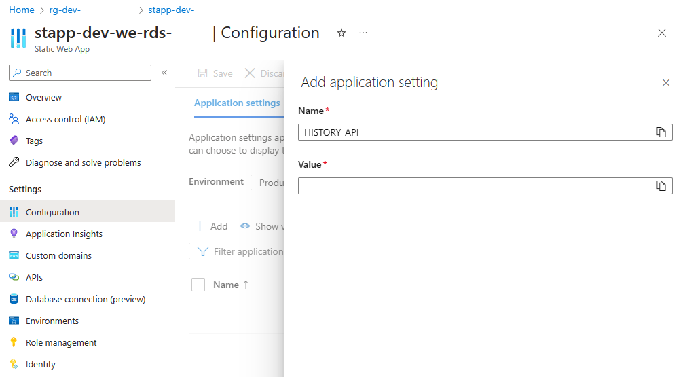

Hit `Save` and wait for the Static Web App to reload then open the url of the Static Web App.

Once it gets loaded, click on the UUID of the user on the top right of the page and ensure you can see the latest products that you have viewed


</details>

[redis-console]: https://learn.microsoft.com/en-us/azure/azure-cache-for-redis/cache-configure#redis-console
[redis-scan-command]: https://redis.io/commands/scan/
[redis-xrange-command]: https://redis.io/commands/xrange/#--and--special-ids
[redis-insight]: https://redis.com/redis-enterprise/redis-insight/
[azure-cache-for-redis-connection-string]: ./assets/azure-cache-for-redis-connection-string.png
[key-bindings]: https://learn.microsoft.com/en-us/azure/azure-functions/functions-bindings-cache-trigger-redispubsub?tabs=in-process%2Cnode-v3%2Cpython-v1&pivots=programming-language-csharp#examples
[key-notifications]: https://redis.io/docs/manual/keyspace-notifications/
[azure-function-overview]: https://learn.microsoft.com/en-us/azure/azure-functions/functions-overview?pivots=programming-language-csharp
[key-notifications-setup]: https://redis.io/docs/manual/keyspace-notifications/#configuration
[redis-triggers-sample]: https://learn.microsoft.com/en-us/azure/azure-cache-for-redis/cache-tutorial-functions-getting-started#set-up-the-example-code
[redis-stream-trigger]: https://learn.microsoft.com/en-us/azure/azure-functions/functions-bindings-cache-trigger-redisstream
[func-start]: https://learn.microsoft.com/en-us/azure/azure-functions/functions-core-tools-reference?tabs=v2#func-start
[postman-link]: https://www.postman.com/

---

# Lab 4 : Azure Cache for Redis Governance 

In this lab you will discover how to retreive metrics and logs from Azure Cache for Redis to monitor the health of the resource and take informed decisions about its sizing.

## Azure Monitor 

To simulate a real world scenario, the first thing to do is to generate some load on the Azure Cache for Redis resource. To be able to do this, you will use the [Redis-Benchmark][redis-benchmark] tool installed in the devcontainer.

Redis Benchmark is a simple command-line utility designed to simulate running a certain number of queries from a defined set of parallel clients. 

To authenticate to your Azure Cache for Redis resource you will need an access key. Go to the Azure Portal and inside the Azure Cache for Redis resource in the left menu, click on **Access keys** and copy the `Primary` or `Secondary` key. 

Next, to generate some load on the Azure Cache for Redis resource use the following command : 

```bash
redis-benchmark -h <YOUR_REDIS_RESOURCE_NAME>.redis.cache.windows.net -p 6379 -a <YOUR REDIS_ACCESS_KEY> -t GET -n 10000000 -d 1024 -c 300 --threads 2 
```

Redis Benchmark will send 10 million `SET` queries of 1KB each from 300 parallel connections. In this lab's use case, the duration of the operation will mainly be influenced by the codespace/dev environment CPU, RAM and network bandwidth resources.

When the benchmark is done, you should see this kind of results :

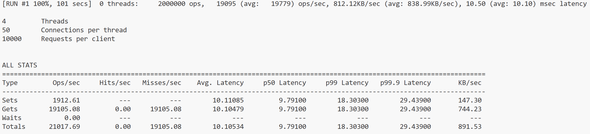

About 5 minutes after the benchmark has successfully ended, open the Azure Portal view on your Azure Cache for Redis resource and open the **Insights** panel to gain deeper knowledge of the resource health : 


And then inside the **Performance** tab you can check how the resource performed under load : 


These metrics are available out of the box, with any Azure Cache for Redis SKU and are precious insights to take informed decisions concerning the sizing of your caching resource.

The Azure Cache for Redis Enterprise SKU also comes with `autoscaling` capabilities to guarantee necessary caching resources at all times. 

Currently, only the Enterprise SKU support the `autoscaling` feature. However, you can do it manually using the `Premium` SKU, enabling the `cluster` option and taking advantage of Azure Monitor Alerts to respond to increasing usage trends and trigger additional node and shard provisionning. 

## Usage Trend monitoring

Let's create an [alert rule][alert-rule-creation] with Azure Monitor to send an email notification when the CPU average usage of the Azure Cache for Redis resource is above `40%` for more than `1` minute. When the alert is triggered, you will send an email to notify the Ops team that the usage trend on Redis increased.

In a real world scenario this alert could be coupled with a request to increase the number of nodes in the cluster to help you respond to usage increase, as well as scale down rule to reduce the number of nodes when demand drops. For simplicity and to avoid scaling delay for the lab, we'll limit to a simple email notification here.

<div class="task" data-title="Task">

> - Create a `static alert rule` to trigger when CPU reaches `40%` on `average` during `1` minute
> - Create an [`action group`][action-group-creation] that will be executed by this alert rule 
> - The `action group` must send an `email` notification to your email address 
> - Execute a new benchmark of `10 Million` requests to load the Azure Cache for Redis CPU and trigger the alert

</div>

<details>

<summary>Toggle solution</summary>

To do so, open the Azure Portal on your Azure Cache for Redis resource and open the **Metrics** panel.

In the **Metric** dropdown, select `CPU` and set **Aggregation** to `Avg` and click on **New alert rule** :

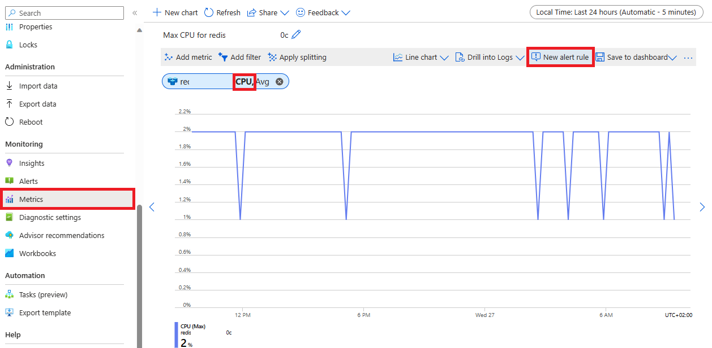

In the **Condition** panel you just opened, make sure to fill in the trigger conditions as follows and click **Next: Actions >** : 

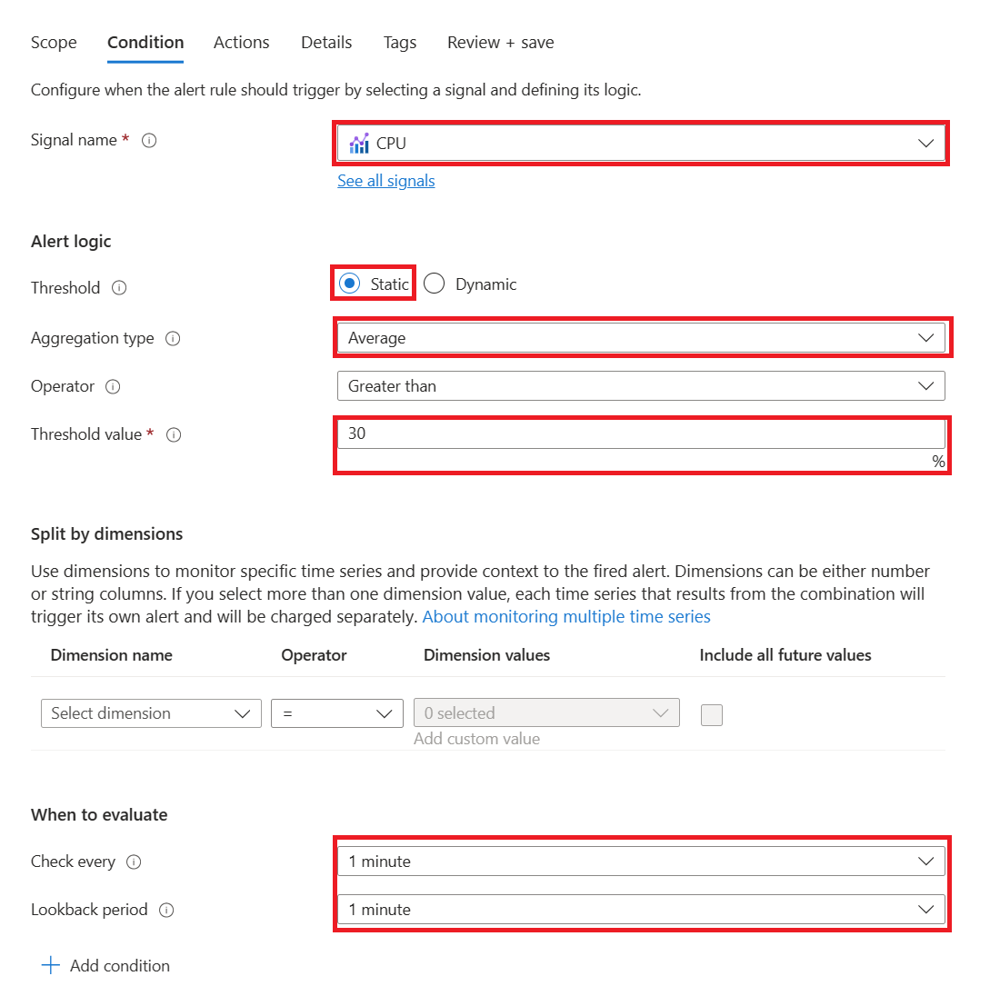

Now you have the rules set to trigger the notification, it's time to set the actual action that will send the notification.
To do so, click **Create action group**, set the action group to your `resource group`, give it a `name` and `Display name` and click **Next: Notifications >**:

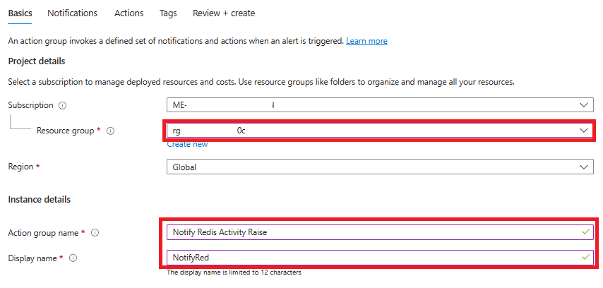

Select the **Notification Type** `Email/SMS message/Push/Voice`, tick **Email** in the panel that just opened and fill in your `email address`, then save by clicking **OK**. Once done, you'll have to give a **Name** to the notification type you just set and click **Review + Create** : 

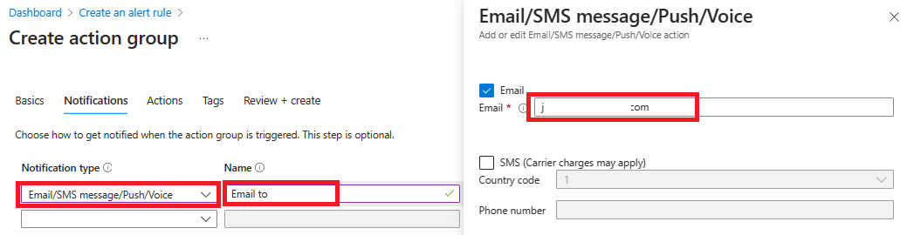

Check the action group you just created is added in the Action Group list and click **Next: Details >**: 

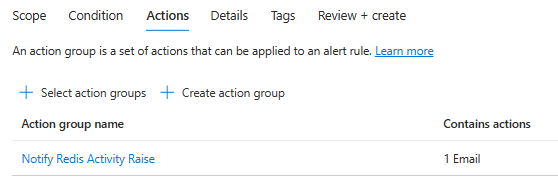

Now is time to finalize the configuration of the alert rule, giving it a `resource group` save location, defining the **Severity** to `2 - Warning` and an `Alert rule name`. When done, hit **Review + Create** : 

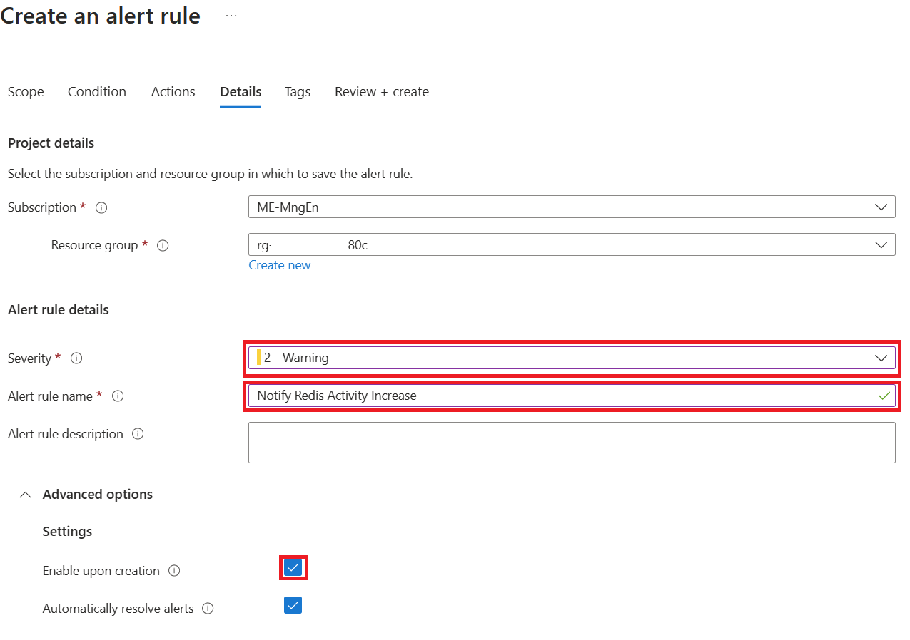

Now the alert is created, you can test it by generating some load on the Azure Cache for Redis resource using the [Redis-Benchmark][redis-benchmark] tool like you did before.

Run the same **redis-benchmark** command from your devcontainer/copdespace terminal as earlier :

```bash
redis-benchmark -h <YOUR_REDIS_RESOURCE_NAME>.redis.cache.windows.net -p 6379 -a <YOUR REDIS_ACCESS_KEY> -t GET -n 10000000 -d 1024 -c 300 --threads 2 
```

After the benchmark ended, you will be able to check the trigger history by clicking **Alerts** and then **Alert Rules** in the Azure Cache for Redis resource and select the Alert Rule you built in this lab, and open the **history** panel where you should see the alert trigger details  :

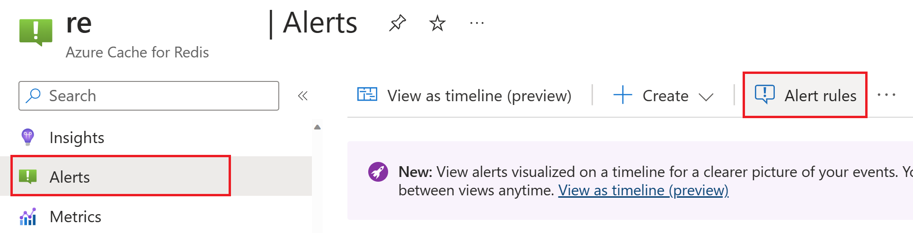
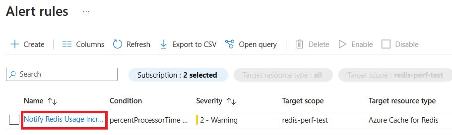
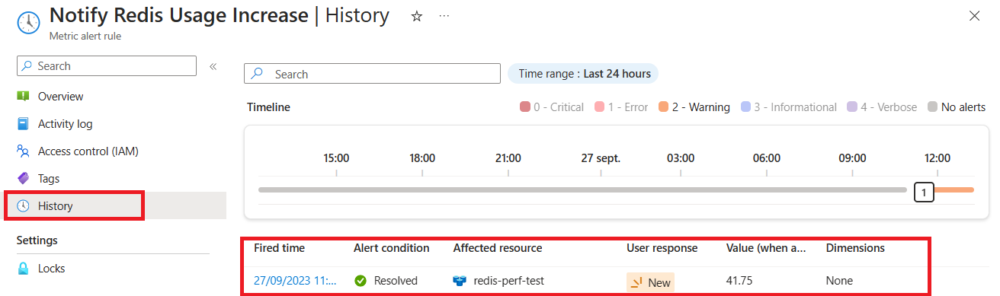

As a side note, we really encourage you to take the time to dig in the toolbox offered by the Azure Portal to help you quickly **diagnose and solve problems** with the configuration of the resource or the connected clients : 


</details>

[alert-rule-creation]: https://learn.microsoft.com/en-us/azure/azure-monitor/alerts/alerts-create-new-alert-rule?tabs=metric 
[action-group-creation]: https://learn.microsoft.com/en-us/azure/azure-monitor/alerts/action-groups#create-an-action-group-in-the-azure-portal

## Security (RBAC + Private Endpoint ?)

<!-- TODO : Add Managed Identity access rather than secret based -->
<!-- TODO : Expand on Data Access roles and security managed by AAD -->

<div class="tip" data-title="Tips">

> [`Microsoft.Azure.StackExchangeRedis`][redis-dev-wrapper] is a wrapper to StackExchange.Redis client library, built to extend its capabilities and offer Azure Active Directory (secret-less) authentication.

</div>

# Closing the workshop

Once you're done with this lab you can delete the resource group you created at the beginning.

To do so, click on `delete resource group` in the Azure Portal to delete all the resources and audio content at once. 
The following Az-Cli command can also be used to delete the resource group :

```bash
# Delete the resource group with all the resources
az group delete --name <resource-group>
```

[redis-benchmark]: (https://redis.io/docs/management/optimization/benchmarks/)
[redis-dev-wrapper]: https://github.com/Azure/Microsoft.Azure.StackExchangeRedis/