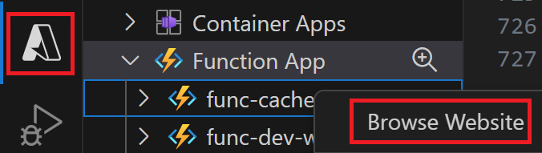
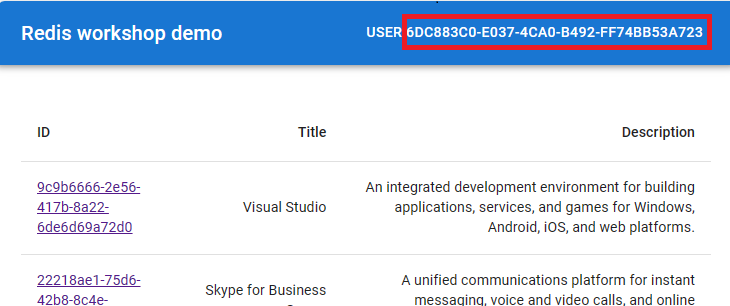

# Azure Cache for Redis Workshop

Welcome to this Azure Cache for Redis Workshop. You will be experimenting with Azure Cache for Redis in multiple labs to discover how it's integrated to other Azure services by running a real world scenarios. Don't worry, even if the challenges will increase in difficulty, this is a step by step lab, you will be guided through the whole process.

During this workshop you will have the instructions to complete each steps. It is recommended to search for the answers in provided resources and links before looking at the solutions placed under the 'Toggle solution' panel.

## Prerequisites

Before starting this workshop, be sure you have:

- An Azure Subscription with the **Contributor** role to create and manage the labs' resources and deploy the infrastructure as code
- To run the different labs, you have 2 possibilities:
    - Run everything using pre-configured GitHub Codespaces which will provide you a full environment with all the tools you need
    - Use your own environment and install the tools needed to run the labs locally

If you want's to run the labs locally, make sure you have:
- Docker
- [Visual Studio Code][vs-code] installed (you will use Dev Containers)
- Git
- A GitHub Account
- The [Azure][azure-vs-code-extension]

<div class="task" data-title="Task">

> You will find the instructions and expected configurations for each Lab step in these yellow "Task" boxes.
> Inputs and parameters to select will be defined, all the rest can remain as default as it has no impact on the scenario.

</div>

Let's begin!

## Sign in to Azure

<div class="task" data-title="Task">

> - Log into your Azure subscription locally using Azure CLI and on the [Azure Portal][az-portal] using your own credentials.
>
> - Instructions and solutions will be given for the Azure CLI, but you can also use the Azure Portal if you prefer.
> - Register the Azure providers on your Azure Subscription if not done yet: `Microsoft.Web`

</div>

<details>

<summary>Toggle solution</summary>

```bash
# Login to Azure
az login
# Display your account details
az account show
# Select your Azure subscription
az account set --subscription <subscription-id>

# Register the following Azure providers if they are not already
# Azure Functions
az provider register --namespace 'Microsoft.Web'
```

</details>

[az-cli-install]: https://learn.microsoft.com/en-us/cli/azure/install-azure-cli
[az-func-core-tools]: https://learn.microsoft.com/en-us/azure/azure-functions/functions-run-local?tabs=v4%2Clinux%2Ccsharp%2Cportal%2Cbash#install-the-azure-functions-core-tools
[vs-code]: https://code.visualstudio.com/
[azure-vs-code-extension]: https://marketplace.visualstudio.com/items?itemName=ms-vscode.vscode-node-azure-pack
[az-portal]: https://portal.azure.com/signin/index/

---

# Lab 0 : Azure Cache for Redis

## Setting up the infrastructure in Azure

First thing you need to do is to fork the [repository][hands-on-lab-github-fork] and clone it. Open the devcontainer or the GitHub Codespaces inside the `terraform` folder, which contains the infrastructure as code that needs to be deployed to do this Hands On Lab. This will deploy a series of Azure services that you will use in combination with Azure Cache for Redis.

In a terminal run the following command to initialize terraform:

```bash
terraform init
```

Then to deploy the infrastructure:

```bash
terraform apply -auto-approve
```

The deployment take between 15 to 25 minutes depending on the Azure demands. 

## Architecture overview

While you are deploying the infrastructure of the labs, let's discover it together:


The architecture is composed of the following elements:
- An Azure Static Web App that will be used to display the data from the API
- An App Service that will host an API and store the data in a Cosmos DB database
- An APIM which will be used as a facade for the API
- An Azure Cache for Redis that will be used to cache the data of the API
- An Azure Function that will be triggered by an event of the Azure Cache for Redis to refresh the cache when the data expired
- An Azure Monitor that will be used to monitor the Azure Cache for Redis

You will discover all these elements during this Hands On Lab.

## Seed the database

In this Hands On Lab, you will use a Cosmos DB database to store and retrieve your data. To save time, you will seed it with some data.

To do this, download the [zip file][database-seed-zip] that contains the data to seed your database, then unzip it and you will find a `products.json` file.

Go to your resource group, search the Cosmos DB account, select it and in the left menu, click on **Data Explorer**. Then on the database called `catalogdb` and click on the `products` container and select `Items` like below:


Then, click on the **Upload Item** button and select the `products.json` file you just downloaded and click **Upload**. This will upload the data in your database:


*The number of products in the screenshot can differ from the number of products you have in your file.*

Now, if you close the **Upload Item** window and click on the **Refresh** button, you should see the data in your database:


You have now seeded your database with the data for this Hands On Lab.

## Redis basics 

To be able to use Azure Cache for Redis, you need to understand the basics of Redis. Redis is an open source, in-memory data structure store, used as a database, cache, and message broker. It supports data structures such as strings, hashes, lists, sets, sorted sets with range queries, bitmaps, hyperloglogs, geospatial indexes with radius queries and streams.

Let's see quickly how to use Redis using the Azure Cache for Redis. Go to your resource group, search the Azure Cache for Redis, select it and in the left menu, click on **Overview** and click on the **Console** button:


Now inside the console, let's play with basic Redis commands.

Run the following command to set a key/value pair in Redis:

```bash
set key1 myvalue1
```

To retrieve the value of the key, run the command:

```bash
get key1
```

To check if a key exists in Redis, just run:

```bash
exists key1
```

To delete a specific key in Redis, run the command:

```bash
del key
```

Run the following commands to set a key with an expiration of 10 seconds in Redis:

```bash
set key1 myvalue1
expire key1 10
```

After 10 seconds, if you run the `get` command on `key1`, you will see that the key will return `nil` which means that the key doesn't exist anymore.

To test if Redis is working, you can run the `ping` command:

```bash
ping
```

It should return `PONG` which means that Redis is working.


To summarize, you can use the following basic commands to interact with Redis:

- `set` [key] [value]: Sets a key/value in the cache. Returns `OK` on success.
- `get` [key]: Gets a value from the cache.
- `exists` [key]: Returns `1` if the key exists in the cache, otherwise `0` if it doesn’t.
- `del` [key]: Deletes the value associated with the key.
- `expire` [key] [value in seconds]: Expires the key after the specified number of seconds.
- `ping`: Ping the server. Returns `PONG`.

[database-seed-zip]: https://github.com/microsoft/hands-on-lab-redis/releases/download/latest/database-sample-data.zip
[hands-on-lab-github-fork]: https://github.com/microsoft/hands-on-lab-redis/fork

---

# Lab 1 : Use Azure Redis Cache in your API

In this lab, you will see how to use Azure Cache for Redis in your API to improve its performance. This API is written using .NET 7 and you will use the [StackExchange.Redis][stackexchange-redis] NuGet package to interact with Redis. One of the goal of this API is to provide a list of products that you will display in a web application.

## Run the API

Open the `src/catalog-api` folder in Visual Studio Code using the devcontainer or the GitHub Codespaces.

For the purpose of this lab you will have to add a delay for the response of the API to be able to see the difference between the response time with and without the cache. This is because a database like Cosmos Db is able to return the data in a few milliseconds after a few calls so you wont be able to see the difference between the response time with and without the cache after a few retry.

To do this, copy the entire content of the `appsettings.json.template` into the `appsettings.Developement.json` file and add set the `SIMULATED_DB_LATENCY_IN_SECONDS` value to `2`.

<div class="task" data-title="Task">

> - Run the API locally or use the provided GitHub Codespaces.
> - Call the `/products` endpoints to confirm that the API is working

</div>

<details>

<summary>Toggle solution</summary>

Restore the dependencies of the project by running the following command:

```bash
dotnet restore
```

Then, run the following command to run the API:

```bash
dotnet run
```

Then go to the following url: http://localhost:5076/products and you should see the list of products.
</details>

## Add Azure Cache for Redis to your API

If you look at the `Catalog.Api.csproj` you will see that the `StackExchange.Redis` NuGet package is already referenced in the project. This is the package that will allow you to use Azure Cache for Redis in your API.

The goal of this part is to setup the Azure Cache for Redis in your API and to use it to improve the performance of the `/products` endpoint. To do this, you will use the `ProductCacheService.cs` class which is pre-configured for you.

If you open it you will see two methods:
- `GetProductsAsync`: This method is used to get the products from the cache
- `SetProductsAsync`. This method is used to set the products in the cache. 

They both use the `IRedisService` interface to interact with the cache and use the mechanism of serialization/deserialization to store and retrieve the data.

<div class="task" data-title="Tasks">

> - Now, open the `ProductEndpoints.cs`
> - Use the `IProductCacheService` to setup the cache in the `/products` endpoint
> - Don't forget to fill the missing values inside the `appsettings.Developement.json` to be able to connect to your Azure Cache for Redis **and** Cosmos Db

</div>

<details>
<summary>Toggle solution</summary>

Now, open the `ProductEndpoints.cs` and in the endpoint `/products` use the `IProductCacheService` to retreive the products from the cache. If some products are found in the cache, return them directly: 

```csharp
IEnumerable<Product>? cachedProducts = await productCacheService.GetProductsAsync();

if (cachedProducts != null) {
    Console.WriteLine("Returning product list from the cache");
    return Results.Ok(cachedProducts);
}
```

If no product are found in the cache, fetch the data from Cosmos DB and store them in the cache before returning them:

```csharp
// Fetch data from Cosmos DB
var products = await cosmosService.RetrieveAllProductsAsync();

if (products.Any()) {
    await productCacheService.SetProductsAsync(products);
}

return Results.Ok(products);
```

So the final code of the endpoint should look like this:

```csharp
app.MapGet("/products", async (ICosmosService cosmosService, IProductCacheService productCacheService) => {
    IEnumerable<Product>? cachedProducts = await productCacheService.GetProductsAsync();

    if (cachedProducts != null) {
        Console.WriteLine("Returning product list from the cache");
        return Results.Ok(cachedProducts);
    }

    // Fetch data from Cosmos DB
    var products = await cosmosService.RetrieveAllProductsAsync();

    if (products.Any()) {
        await productCacheService.SetProductsAsync(products);
    }

    return Results.Ok(products);
});
```

Now, if you run your API again using Postman or the HTTP REST file, and call the `/products` endpoint, you should see the response time of your API reduced to a few milliseconds!
</details>

## Deploy the API to Azure

Now that you have your API working locally, you will deploy it to Azure. To do this, you will use the Azure App Service. This service allows you to host your API in the cloud.

To deploy your API directly from Visual Studio Code, you will use the Azure extension.

Search your App Service in the Visual Studio Code Azure extension and click on the **Deploy to Web App...** button:


Then, select the `catalog-api` folder and click on the **Deploy** button. Wait a few minutes for the deployment to finish. All the environment variables such as the connection string to Azure Cache for Redis and Cosmos Db was already configured in the Azure App Service for you by the infrastructure as code.

When it's done go to your App Service resource on Azure and click on the **Browse** button. Navigate to the `/products` endpoint and you should see the list of products:


Of course you can do it using Postman or the HTTP REST file inside the `src/payloads` folder of this Hands On Lab repository.

[api-zip]: https://github.com/microsoft/hands-on-lab-redis/releases/download/latest/catalog-api.zip
[stackexchange-redis]: https://www.nuget.org/packages/StackExchange.Redis

---

# Lab 2 : Add cache to your API with APIM

In the previous lab, you saw how to add code in your API to be able to use an Azure Cache for Redis. In this lab, you will see how to add a cache to your API without modifing its code.

## Architecture reminder

If you look at the architecture that you deployed for this workshop, remember that you have an API Management (APIM) in front of the API that provide you the different products.


The APIM is used as a facade for all your APIs (in this case you only have one), in the next section you will discover how to add a cache on your APIs using the APIM and Azure Cache for Redis.

## Disabling cache in your API

In the previous lab, you added code in your API to use an Azure Cache for Redis directly on the `/products` endpoint. To avoid modifying the code of your API, we have added an environment variable called `PRODUCT_LIST_CACHE_DISABLE` that you can use to enable or disable the cache on this endpoint.

To disable the cache, you need to set the value of this environment variable to `1`. To do this, go to your resource group, search the App service, select it and in the left menu, click on **Configuration**. 
You will see the `PRODUCT_LIST_CACHE_DISABLE` environment variable, select the edit button:


and set the value to `1` and click on the **OK** button.

Now if you try to call your API on the `/products` endpoints you should see the response time of your API taking multiples seconds again.

## Setup APIM External 

First things you need to do, is to connect your Azure Cache for Redis to your APIM. To do this, you need to add it as an external cache in your APIM configuration.

<div class="task" data-title="Tasks">

> - Inside your APIM link your Azure Cache for Redis as an external cache
> - Make sure to choose the `Default` region to be able to use it from all your APIM instances

</div>

<details>
<summary>Toggle solution</summary>

Go to your resource group, search the API Management service (APIM), select it and in the left menu, click on **External cache**.


Then click on **Add** and fill the form with the following information:

- In the `Cache instance` field, select the Azure Cache for Redis you deployed using the infrastructure as code
- In the `Use from` field, set the region to `Default`, this will allow your Azure Cache for Redis to be used by all your APIM instances whatever their region.


Then, click the **Save** button.

You should now see your Azure Cache for Redis in the list of external cache:


</details>

### Setup APIM Cache Policy globally

Now that you have your Azure Cache for Redis connected to your APIM, you need to configure it to use it. To do this, you will use policy.

<div class="task" data-title="Tasks">

> - Using the interface add the policies `cache-lookup` and `cache-store` to cache all the operations of your API
> - Set the duration to `30` seconds for the cache to be able to test it

</div>

<div class="tip" data-title="Tips">

> You can find more information about the cache policies here:<br>
> [Cache Lookup Policy][cache-lookup-policy]<br>
> [Cache Store Policy][cache-store-policy]

</div>

[cache-lookup-policy]: https://learn.microsoft.com/en-us/azure/api-management/cache-lookup-policy
[cache-store-policy]: https://learn.microsoft.com/en-us/azure/api-management/cache-store-policy

<details>
<summary>Toggle solution</summary>

To be able to compare the performance of your API with and without the cache, you will first call it without the cache using [Postman][postman-link] or using the `products.http` inside the `Payloads` folder.

To do so, go to your resource group, search the API Management service (APIM), select it and in the left menu, click on **APIs**. You will see a **Products** API with a **Get Products** operation:


Go to the **Test** tab of the **Get Products** operation in your APIM and take the generated url inside the `Request URL` section.

Now using Postman or HTTP REST file for instance you should see the response time of your API taking multiples seconds:


Now to reduce this time you can specify a policy to use the cache. Select **All operations** in the **Inbound processing** section and click on the **+ Add policy** button:


Select the cache-lookup/store policy and click on the **Add** button:


Set the duration to `30` seconds for the cache to be able to test it and click **Save**:


In real life scenario, this value will depend on your business needs.

That's it! You have now your cache policy setup **globally** on your API. You can now test it again with Postman or HTTP REST you should see the response time of your API reduced to a few milliseconds!
</details>

### Caching a specific operation

In the previous section, you saw how to setup a cache policy globally for all your operations. But what if you want to cache only a specific operation?

Before testing this scenario, you need to remove the global cache policy you just added. To do this, go to the **All operations** section of your API and click on the **...** button of the **cache-lookup** and the **cache-store** policies and select **Delete**:


Then click on the **Save** button.

<div class="task" data-title="Tasks">

> - This task is a more advanced one, you will need to edit the policy manually
> - Use the policies `cache-lookup-value` and `cache-store-value` to cache only the **Get Products** operation
> - Set the duration to `60` seconds for the cache to be able to test it
> - You will need to use the `return-response` in the `inbound` block of the policy to return the result of the cache directly if it exists

</div>

<details>
<summary>Toggle solution</summary>

To cache only the **Get Products** operation you need to specify the redis cache key. To be able to do this you will use two policies: `cache-lookup-value` `cache-store-value`. They are a bit different from the previous policies as they allow you to specify the key to use in the cache.

This time, you will need to edit the policy manually. So go to the **Get Products** operation and click one of the **Policy code editor** button:


Then, inside the editor replace the inbound block of the policy with the following content:

```xml
<inbound>
    <base />
    <cache-lookup-value key="products:all" variable-name="allproducts" caching-type="external" />
    <choose>
        <when condition="@(context.Variables.ContainsKey("allproducts"))">
            <return-response>
                <set-status code="200" reason="OK" />
                <set-header name="Content-Type" exists-action="override">
                    <value>application/json</value>
                </set-header>
                <set-body>@((string)context.Variables["allproducts"])</set-body>
            </return-response>
        </when>
        <otherwise />
    </choose>
</inbound>
```

This policy will first try to get the value from the cache using the key `products:all` and if it exists, it will return it. If it exists it will return the result of the cache directly using the `return-response`. If it doesn't exist, it will continue the execution of the policy.

Then, add the following policy in the outbound block of the policy:

```xml
<outbound>
    <base />
    <cache-store-value key="products:all" value="@((string)context.Response.Body.As<string>(preserveContent: true))" duration="60" caching-type="external" />
</outbound>
```

This policy will store the result of the operation in the cache using the key `products:all` and the value of the response body. It will store it for 60 seconds. Of course, you can change the key and the duration to fit your needs.

Notice the `external` cache type is used in both policies. This is because you are using an external cache which is Azure Cache for Redis in your case. If you were using the internal cache of the APIM, you would have used the `internal` cache type.

Then, click on the **Save** button.

You can now test your API again with Postman or the HTTP REST file like previously and you should see the response time of this particular operation reduced to a few milliseconds, but this time only for the **Get Products** operation.

[postman-link]: https://www.postman.com/
</details>

---

# Lab 3 : Event-Driven Architecture 

In this lab we will see how to create cloud-native applications which can integrate with Azure Cache for Redis.

For instance we will create 2 Function Apps which react to changes in Redis to perform an action:
- `cache-refresh-func`: detect expired cache keys and trigger a cache warm up to re-populate them
- `history-func`: process browsing history events from a Redis Stream and expose them via an HTTP API

## Lab 3.1: cache-refresh-func

In the previous lab about APIM you saw how to add a cache to your API without modifying its code. In this lab you will see how to refresh the cache when the data expired before the data is requested by the user.

The idea is to use an [Azure Function][azure-function-overview] triggered by an Azure Cache for Redis event to refresh the cache when the data expired.

Azure Functions is a serverless solution that provides up-to-date compute resources, so you don't need to worry about deploying and maintaining infrastructure. It offers a common function programming model for various languages, allowing you to focus on your code while Azure Functions handles the rest.

Azure Functions are event-driven and triggered by events from various sources. The model uses `triggers` and `bindings` to avoid hardcoding access to other services:

- Bindings connect other resources to the function declaratively
- Triggers define how a function is invoked and provide associated data as a parameter payload.

Azure Functions run on the App Service platform, which provides features such as deployment slots, continuous deployment, HTTPS support, and hybrid connections. They can be deployed in the Consumption (Serverless), dedicated App Service Plan, or Premium Plan models.

### Keyspace Notifications

While Azure Cache for Redis manages the wraping of Keyspace events, it's mandatory to detail the event types you're interested in.

To do so, you'll set the maximum level of notification possible to notify all the existing events in the Azure Cache for Redis **Advanced Settings** and **notify-keyspace-events**:


<div class="tip" data-title="Tips">

> Resources : You'll find more insights [here][key-notifications-setup] on the events type that can be notified to fine-tune the notifications' scope

</div>

### Redis Triggered Azure Function

Open the Azure Function project in Visual Studio Code which is under `src/functions` and go to the `RefreshProductsCache.cs`. You will discover a method called `ProductsEventsTrigger` which is empty.

This method has an attribute called `RedisPubSubTrigger` which is used to trigger the function when an event is raised by the Azure Cache for Redis.

<div class="task" data-title="Tasks">

> - Define the conditions to trigger the function based on the expiration of a key in the Azure Cache for Redis
> - The connection string of the Azure Cache for Redis is defined by the environment variable `AZURE_REDIS_CONNECTION_STRING`

</div>

<div class="tip" data-title="Tips">

> You can find more information about the keys here:<br>
> - The Azure Function here use the isolated process mode but at this time the documentation is not updated so use the in-process tab to see examples: [Key Binding][key-bindings]<br>
> - [Redis key notification][key-notifications]<br>
</div>

<details>
<summary>Toggle solution</summary>

The `RedisPubSubTrigger` attribute is used to trigger the function when an event is raised by the Azure Cache for Redis, so the first parameter is the connection string and the second one is the pattern to listen to.

The connection string environment key `AZURE_REDIS_CONNECTION_STRING` can be specified directly because Azure Functions automatically understands that it is a connection string. Then based on the [Redis key notification documentation][key-notifications] you can use the `expired` event so the pattern to listen to the expiration event of a key will be `__keyevent@0__:expired`.

So the definition of the function should look like this:

```csharp
public async Task ProductsEventsTrigger(
    [RedisPubSubTrigger("AZURE_REDIS_CONNECTION_STRING", "__keyevent@0__:expired")] string key)
```

</details>

### Refresh the Redis Cache

Now that we have defined the conditions to trigger the function, we need to implement the logic to refresh the cache.

The key to listen to is defined in the `local.settings.json.template` file in the `REDIS_KEY_PRODUCTS_ALL` environment variable. This environment variable is set to `products:all` which is the key that you used in the previous lab to store the products in the cache.

All environment variables are defined in the `local.settings.json` that you must create if you want to run this Azure Function locally (you just have to copy paste the template from the `local.settings.json.template` file).

If you run this Azure Function and listen to the expired keys in the Azure Cache for Redis, you will see that the function is triggered when a key with a suffix of `products:all` is expired. In fact this is because APIM add a prefix to it to avoid conflicts with other keys so you can see a key like `1_products:all` for instance.

<div class="task" data-title="Tasks">

> The goal is to detect when the cache is expired and to refresh it for the `products:all` key.
> - Only refresh the cache if the key contains `products:all`
> - Use the `Const.cs` file to point to the `REDIS_KEY_PRODUCTS_ALL` environment variable
> - Call the Catalog Api using the `IHttpClientFactory` object provided to retrieve the `products`
> - Store the **string** result into Azure Redis Cache using the `IRedisService`
> - Only this method should be modified

</div>

<details>
<summary>Toggle solution</summary>

First you need to check if the key contains `products:all` and if it does, you need to refresh the cache. 

Then call the Catalog API using the `IHttpClientFactory` object provided to retrieve the `products` using the `GetStringAsync` method which will return a string of the response. Then store the result into Azure Redis Cache using the `IRedisService` with the `Set` method.

```csharp
public async Task ProductsEventsTrigger(
    [RedisPubSubTrigger("AZURE_REDIS_CONNECTION_STRING", "__keyevent@0__:expired")] string key)
{
    if (key.Contains(Const.REDIS_KEY_PRODUCTS_ALL))
    {
        var result = await _httpCatalogApiClient.GetStringAsync("products");
        await _redisService.Set(key, result);
    }
}
```

Now, to run it locally you need to create the `local.settings.json` file and copy the content of the `local.settings.json.template` file into it. 

Then you need to set the `AZURE_REDIS_CONNECTION_STRING` environment variable to the connection string of your Azure Cache for Redis and update the `CATALOG_API_URL` with the url of your Catalog API.

The connection string for your Azure Cache for Redis can be found in the Azure Portal. Select your Azure Cache for Redis resource and in the left menu, click on **Access keys**. Then copy the value of the `Primary connection string` into your `local.settings.json` file.

![Azure Cache for Redis connection string][azure-cache-for-redis-connection-string]

[azure-cache-for-redis-connection-string]: ./assets/azure-cache-for-redis-connection-string.png

And to set the `CATALOG_API_URL` environment variable, go to your resource group, search the App service, select it and in the left menu, click on **Overview**. Then copy the **Default Domain** url of your App Service.


In VS Code just run the Azure Function by clicking on the **Run** button:


</details>

### Deploy the Azure Function

#### Deploy your function using the VS Code

- Open the Azure extension in VS Code left panel
- Make sure you're signed in to your Azure account
- Open the Function App panel
- Right click on your function app and select `Deploy to Function App...`



#### Deployment via Azure Function Core Tools

Deploy your function using the VS Code extension or by command line:

```bash
func azure functionapp publish <NAME_OF_YOUR_FUNCTION_APP>
```

#### Test the Azure Function

Now if you go to your Azure Function resource, in the **Overview** tab select your function:


And then inside the **Monitor** tab you should see that the function was triggered when the key `products:all` is expired:


You now have an Azure Function that is triggered every time the key `products:all` is expired and refresh the cache.

## Lab 3.2: history-func

We have previously created a Function App which reacts to cache expiry by listening to keyspace events. In this second part of Lab3 we will create a second Function App which will consume Redis Streams and process incoming Stream entries.

This new Function App will power an API for retrieving a user's browsing history, e.g. which products they have viewed recently.

But before delving into the Function's code, let's first take a look the Streams we currently have at disposal.

### Inspecting product views' stream

First thing first, let's take a look at the data currently available on our Azure Cache for Redis instance.

There is a variety of tools which allows us to inspect Redis like the integrated [Redis Console][redis-console] and also the fully-featured GUI [RedisInsight][redis-insight].


<div class="task" data-title="Task">

>  - Locate the stream where `catalog-api` publishes product viewing events and inspect its contents using the `Redis Console` from the Azure portal.
>  - View some products in the Web App and make sure that you see new items in the stream

</div>

<div class="tip" data-title="Tips">

> - [Redis Console][redis-console]
> - [SCAN command][redis-scan-command]
> - [XRANGE command][redis-xrange-command]

</div>

[redis-console]: https://learn.microsoft.com/en-us/azure/azure-cache-for-redis/cache-configure#redis-console
[redis-scan-command]: https://redis.io/commands/scan/
[redis-xrange-command]: https://redis.io/commands/xrange/#--and--special-ids
[redis-insight]: https://redis.com/redis-enterprise/redis-insight/


<details>
<summary>Toggle solution</summary>

List all Redis keys having a type `stream`:

```sh
SCAN 0 TYPE stream
```

View the list of stream items, we will be using the `productViews` stream:

```sh
XRANGE productViews - +
```
</details>


### Consuming product views' stream using Azure Functions

Now that we have identified the product views' stream, we will need to update the `history-func` Function App to get triggered whenever a new event gets published to the stream.

<div class="task" data-title="Task">

> Update the trigger of the function defined in `src/history-func/ProcessProductViews.cs` so that it listens to news items in the product views' stream

</div>

<div class="tip" data-title="Tips">

> - [Sample of Azure Functions' triggers for Redis][redis-triggers-sample]
> - [RedisStreamTrigger][redis-stream-trigger]

</div>

[redis-triggers-sample]: https://learn.microsoft.com/en-us/azure/azure-cache-for-redis/cache-tutorial-functions-getting-started#set-up-the-example-code
[redis-stream-trigger]: https://learn.microsoft.com/en-us/azure/azure-functions/functions-bindings-cache-trigger-redisstream


<details>
<summary>Toggle solution</summary>

Update the method `StreamTrigger` and replace the trigger plaholder (the `TODO` comment) with the following code: 

```csharp
[RedisStreamTrigger("AZURE_REDIS_CONNECTION_STRING", "%PRODUCT_VIEWS_STREAM_NAME%")] string entry
```

This will make the function trigger whenever there is a new item on the stream identified by the environment variable `PRODUCT_VIEWS_STREAM_NAME`.
The environment variable `AZURE_REDIS_CONNECTION_STRING` is expected to contain the connection string of the Azure Cache for Redis instance.

</details>

### Testing the function locally

Next, we need to ensure that our Function App works as expected and manages to process new events.

To do this, make sure that you have a `local.settings.json` file (a template is available in `src/history-func/local.settings.json.template`), run the function locally, then view a new product in the web app and make sure that you see a new event being processed in the Function App.

<div class="task" data-title="Task">

> Run the `src/history-func` Function App locally and it ensure it gets triggered whenever you view new products in the Web App

</div>

<div class="tip" data-title="Tips">

> - Use a different port for the Function App (e.g. 7072) as the default port may already be used by the `catalog-api` or another function.
> - You can use [func start -p 7072][func-start] to listen on port 7072

</div>

[func-start]: https://learn.microsoft.com/en-us/azure/azure-functions/functions-core-tools-reference?tabs=v2#func-start

<details>
<summary>Toggle solution</summary>

First, we will start by creating a new `local.settings.json` file.

```sh
# Go to the root of the history-func Function App
cd src/history-func

# Create a local.settings.json file from the template
cp local.settings.json.template local.settings.json
```

Then we need to update the value of `AZURE_REDIS_CONNECTION_STRING` using the same connection string from the `cache-refresh-func` Function App.

![Azure Cache for Redis connection string][azure-cache-for-redis-connection-string]

Now that we have the required config, we can run the function:

```sh
# Load all dependencies
dotnet restore

# Start the Function App
func start -p 7072
```

Once it starts, you can browse the Web App and ensure new product views' event processing logs appear on your terminal.

</details>

### Retrieving user browsing history using an HTTP endpoint

Lastly, let's check the HTTP endpoint of `history-func` and ensure that it returns all browsing history for a given user.

<div class="task" data-title="Task">

> Call the `/api/history` endpoint and ensure it returns the latest products that you have viewed on the Web App

</div>

<div class="tip" data-title="Tips">

> The `/api/history` is expecting the user ID to be passed in the `X-USER-ID` header

</div>

<details>
<summary>Toggle solution</summary>

As the function app is already up and running, we can directly call the `/api/history` endpoint with a GET request and ensure the ID of the user for whom we want to get the history is defined in the `X-USER-ID` header.



Before calling the endpoint, make sure to get a User ID by copying the UUID that you see on the top right of the Web App. You can also get it from the field `userId` in the stream data items.

```sh
curl \
    --location 'http://localhost:7072/api/history' \
    --header 'X-USER-ID: <Set the User ID here>'
```
</details>

### Deploying history-func to Azure

We have confirmed that our code is working fine locally, so now we can proceed to the next step: deploying it to Azure.

<div class="task" data-title="Task">

> Deploy the `history-func` app to Azure

</div>

<details>
<summary>Toggle solution</summary>

```sh
func azure functionapp publish <NAME_OF_YOUR_HISTORY_FUNCTION_APP>
```
</details>

### Viewing browsing history in the Web App

In this last part, we will wire the newly deployed `history-func` app to the Web App using the app setting `HISTORY_API`.

This will allow the Web App to communicate with our new History API to retrieve and display the current user's browsing history.

<div class="task" data-title="Task">

> - Update the Web App's app setting `HISTORY_API` to point to the `/api/history` API endpoint of `history-func`.
> - Click on the UUID of the user on the top right of the Web App and make sure you can see your browsing history.

</div>

<details>
<summary>Toggle solution</summary>

Follow the steps below:
- Go to the Static Web App resource in the Azure Portal
- Navigate to the `Configuration` menu on the left
- Add a new app setting named `HISTORY_API` and set the value to the url of the `GetBrowsingHistory` (Function defined within the `history-func` Function App)
- Hit `Save` and wait for the Static Web App to reload
- Open the url of the Static Web App
- Click on the UUID of the user, which appears on the top right of the page
- Ensure you can see the latest products that you have viewed

</details>


[key-bindings]: https://learn.microsoft.com/en-us/azure/azure-functions/functions-bindings-cache-trigger-redispubsub?tabs=in-process%2Cnode-v3%2Cpython-v1&pivots=programming-language-csharp#examples
[key-notifications]: https://redis.io/docs/manual/keyspace-notifications/
[azure-function-overview]: https://learn.microsoft.com/en-us/azure/azure-functions/functions-overview?pivots=programming-language-csharp
[key-notifications-setup]: https://redis.io/docs/manual/keyspace-notifications/#configuration

---

# Lab 4 : Azure Cache for Redis Governance 

## Azure Monitor 

## Scaling 

## Security (RBAC + Private Endpoint ?)
