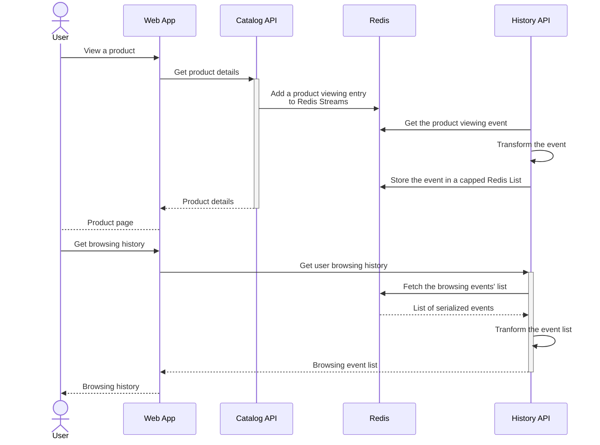

# Browsing history

## Overview

The Browsing history service (deployed as a Function App) provides an API to retrive the list of the latest products viewed by a user.

New browsing history events get added to the service as the user views new products in the UI. The catalog API will then share these events with this service using Redis Streams (identified by `PRODUCT_VIEWS_STREAM_NAME`).

Whenever a new event gets added to the stream, the service performs the following actions:
- Extract the data from the Redis Stream entry
- Serialize it
- Add the data to the history's Redis List of the user who viewed the product
- Ensure the Redis List is capped to the last 10 elements



## Running locally

```sh
# Starting the function on the port 7072
func start -p 7072
```

## Publishing to Azure

```sh
func azure functionapp publish <Function App Name>
```